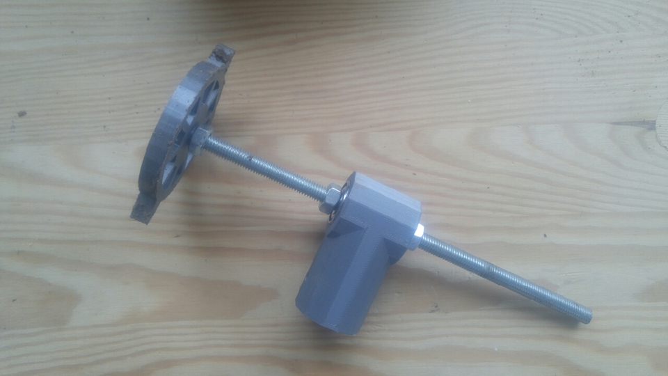
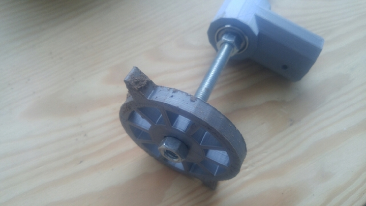
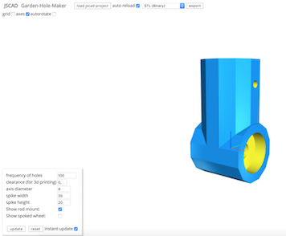
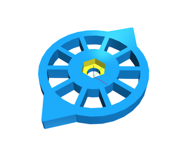

# 3d printed onion planting tool (aka 'gahoma')

## Table of Contents

- [3d printed onion planting tool (aka 'gahoma')](#3d-printed-onion-planting-tool-aka-gahoma)
  - [Table of Contents](#table-of-contents)
  - [About](#about)
  - [Usage](#usage)
  - [Interactive](#interactive)
  - [Pictures:](#pictures)

## About

So I recently planted over 350 winter onions by hand, and it turns out that it is quite a lot of back breaking and repetitive work!

So I Designed and 3d printed a small and simple tool to make aligned and well spaced holes to plant onions in !
- The design is parametric so you can set the desired distance / size for the holes. 
- you can just set the right row distance by tightening the wheels( only one printed so far) at the desired distance
- no back breaking : the central part is mean to put a wooden /pvc/ whatever rod so you can just roll it on the floor without bending over
- open source, what else ? :)

## Usage

The design was creating using [openjscad](openjscad.org), and is available [here](https://github.com/GreenBotics/gahoma)

> note: I am one of the main developpers of OpenJscad and the design will only work with the pre-alpha which you can find [here](https://jscad.xyz/playground.html), you can either:
- download the design above & just drag & drop it onto jscad
- or you can use the fantastic [beaker browser](https://beakerbrowser.com/) and just navigate to https://jscad.xyz/playground.html?uri=dat://gahoma.hashbase.io

> edit: added preliminary [dat](https://datproject.org/) support to openjscad, see below !

## Interactive

Here is an interactive/ embeded version of the above (a bit hacked around, there is no real embeded version YET)

<iframe width="640" height="400" src="https://jscad.xyz/playground.html?uri=dat://gahoma.hashbase.io" frameborder="0" allowfullscreen>
</iframe>

## Pictures:

