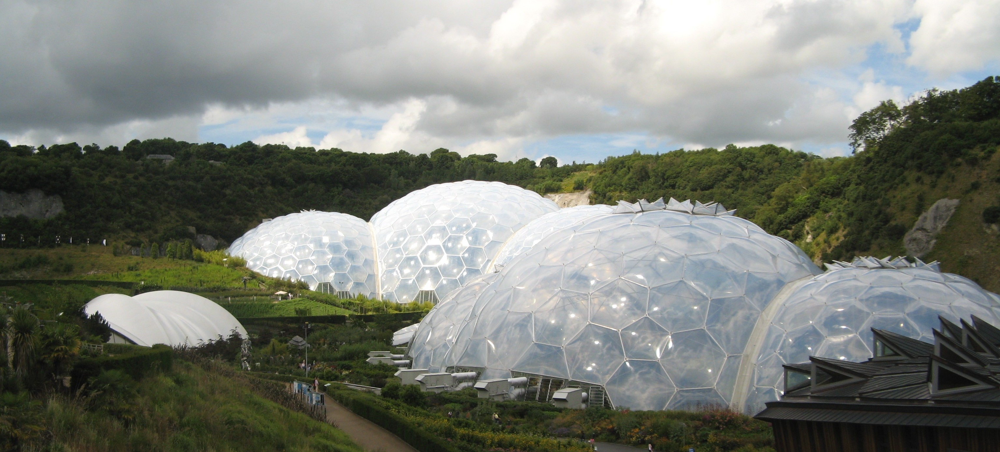
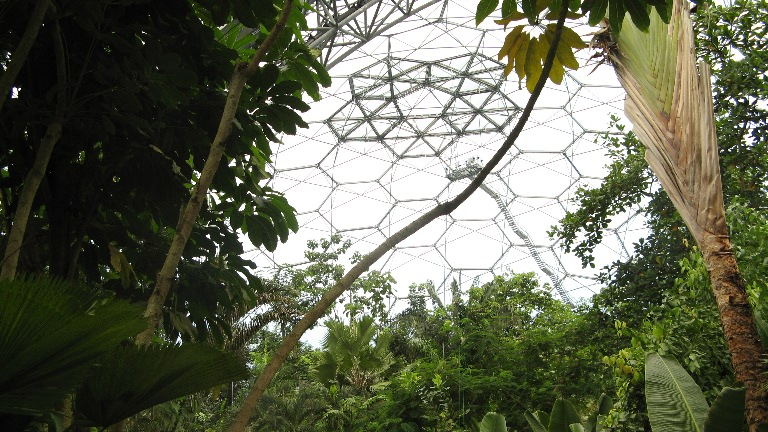
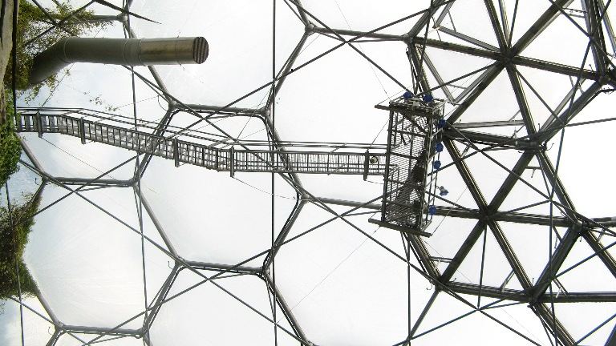
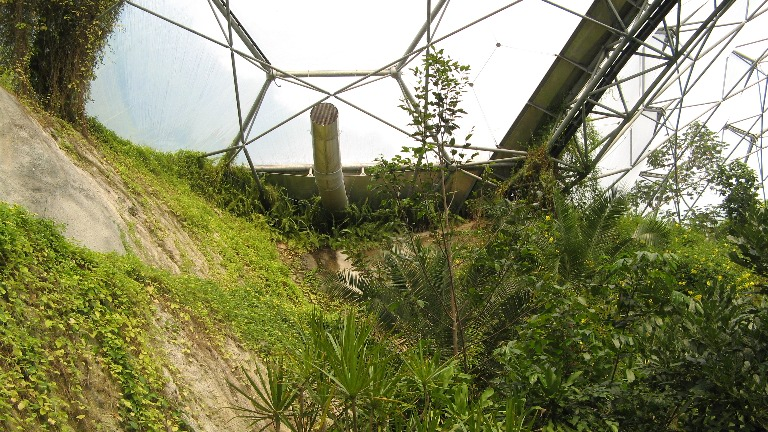
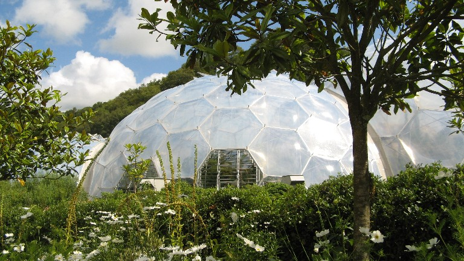

# A visit to the Eden Project (1) 

Last summer i went on a short but fantastic road/foot/train trip to Cornwall (UK), and had the chance to visit the fantastic Eden Project , near St Austel.

So you might ask , what is so special about it ? Well i have been fascinated with giant greenhouses, enclosed ecosystems and terraforming ever since i read about the biosphere 2 experiment (more info [here](http://en.wikipedia.org/wiki/Biosphere_2)) when i was i kid, and of course the giant tents/greenhouses in Kim Stanley Robinsons Mars Trilogy (wikipedia for more [info](http://en.wikipedia.org/wiki/Mars_trilogy)), so i simply could not pass by the occasion to visit it!

- ecologically and from an engineering point of view, it is quite fascinating , as it was built in place of an old open sky quarry, so its is a good way to "re-engineer" the land, repair it , and give it a new purpose and meaning
- as you can see from the pictures, unlike classical greenhouses , it looks very organic
- it is not a closed ecosystem per se , as some parts of the structures are left open to the "outside world"
- it has a very interesting honeycombed structure:

- There are currently two main biomes inside the main greenhouses:  tropical , and Mediterranean, the tropical biome being the most impressive one (95% humidity and around 35°C, it actually fried my cell phone, doh'!)
- The pictures simply do not do the place justice, the sheer size of it is overwhelming
- The surroundings are also lush with greenery ,  examples of special crops and the educational value is absolutely fantastic!

I will post a more detailed article in part 2 in a while, in the meantime, you can find more info here: [http://www.edenproject.com/](http://www.edenproject.com/) as well as here [http://en.wikipedia.org/wiki/Eden\_Project](http://en.wikipedia.org/wiki/Eden_Project)

For accomodation i advise you to stay in St Austel, and visit the surrounding area, as well as the rest of Cornwall, it really is worth seeing , not to mention how nice and welcomming people are.
