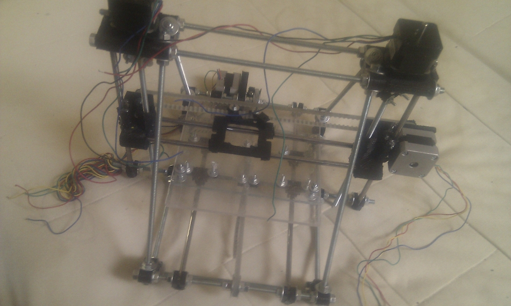
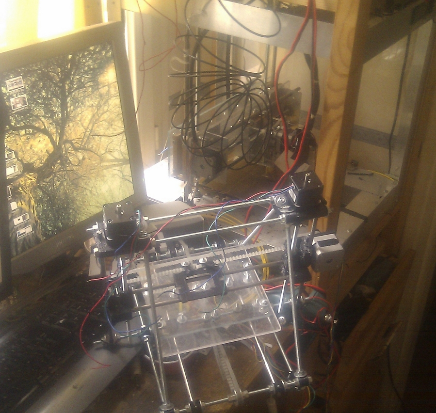

# Bootstraping a Reprap : generation 2 is born ! 

Finally, after weeks ,if not months of work, i finished printing all the necesarry parts for my second gen Reprap . The key aspect of this, is that this was done using my very slow (because of low quality threaded rod driven approach) original repstrap.

More info on the happy birth after the break !

## Sir, you are now the proud father (grandfather?) of a mini "huxley" mendel :

## The "baby", based on [this](http://www.thingiverse.com/thing:4986) design by RustySpoon(with modifications) is alive and well , structurally sound , and with all 3d axis working, more precisely:

- even with the less than perfect print of a number of elements , it works , and it works rather well ! (see videos at the bottom of the page)
- the z axis attachments are surprisingly stable, this is the great design done by Griffin\_Nicol, on thingiverse: [clicky](http://www.thingiverse.com/thing:7153)
- the speed is amazing even when not pushing things too hard i get an X/Y axis speed of about **85mm/s** !!  This might not seem much , but lets put it into context: my current machine has a maximum speed of .. **2.5mm/s** so that is a **34 fold increase in speed !**

Mother and child together:

## Sir, i am afraid there have been complications, the mother might not make it:

Now , unfortunatly , thing aren't quite completely rosy :

- when printing the **last** filament driver part for the machine, the hot end of "Doboz" died
- after some repairs on that , the **motherboard** of  "Doboz" died, this time definetly: i am completely baffled by this , as all the individual components still work, voltages across the board seem to be all ok etc , but at this point , i still haven't been able to restart it
- however, replacement , in the form of a [Gen7 motherboard](http://reprap.org/wiki/Generation_7_Electronics) is on its way !
- also , since i didn't manage to get the filament driver done, i might do a **transplant** of the "mother's" filament driver to the mini mendel , temporarly , so it can finish printing the parts, and much faster than the original machine

## **Parental planning : let's make more kids !**

This mini mendel is actually only the first step towards a "reprap farm" sort of setup : i already have all the necessary electronics / motors etc for a second mini mendel of the same type, so once the new machine starts printing, there will be 3 members in the family.

Also since my Reprap/Repstrap control project , [Doboz-Web](http://www.kaosat.net/?p=1731 "Doboz-Web: Reprap/3d scanner remote control using python, javascript, webgl") , already has (not fully finished) support for multiple machine management and control, i will really be able to step things up.

## **The joys of parenthood: junior's first steps:**

The kiddo's alive and kicking: here are  some short videos of some independant test of each axis :  (still waiting for some components to assemble the final electronics)
