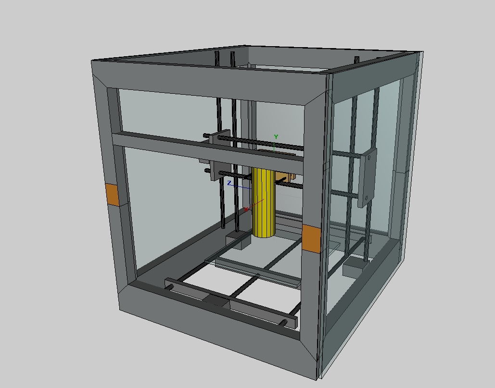
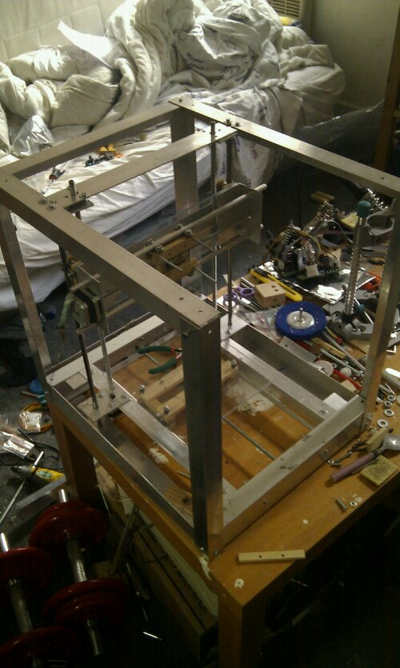

# Building a repstrap (2) design changes: YARP v 0.2  

After the initial trials of a very Reprap "Mendel" style  Repstrap, I decided to alter the design to fit my additionnal needs:

- **protection** from projections and splinters when using the machine in a substractive mode (cnc), as the machine will be standing less than 50 cms away from my head this seems essential
- a **better usage of the available space**, by having the Z axis slaved to the Y axis and not the other way round  (thus making it  closer to the Mendel design actually)
- **more** **stable** axis platforms even if at **lower speeds** : I had no way to ensure the stability of the belt driven versions so I switched back to a **threaded rod** approach

So I switched to a boxed enclosure based structure, made out of L shaped aluminium rails, with 5 mm thick plexiglass protection screens bolted onto the frame. The axis remain essentially the same, save for the Y axis, which can now use the full available height.

Since I had no adapted belts but had an additional stepper motor left over from the printer stripping operation, each threaded rod that moves the axis has its own motor , reducing complexity and necessary parts greatly. As usual I built a simpler proof of concept for this aspect:

So the new and improved specs for the YARP are as follows:

- build volume: 200mm x 200mm x 200 mm
- machine total envelope  : 450 mm (h) x 450 mm (l) x 39 mm (w)
- aluminium frame
- complete enclosure (all functional elements are within the frame)
- modular : the functional elements are attached to "holders" that can be removed from the frame easilly : the "inside" might change, the enclosure will remain the same
- 4 stepper motors, two of those running on the same stepper motor controller

And some pictures and videos of this upgraded design: 

And finally a two axis drawing test video : (i'm sending the commands manually , hence the slowness between each movement):

