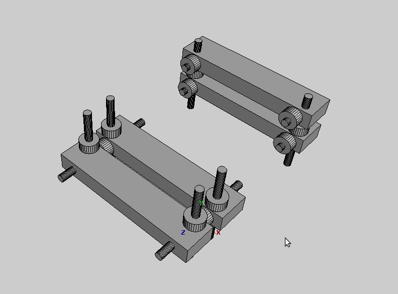

# Building a repstrap (4) progress and problems 

The project is still progressing at a good pace but a lot of smaller and bigger problems have also been cropping up : on some days it really seems like " solve one problem and 10 more will appear": Here is a rundown :

## Progress:

- done an almost complete wiring test (albeit temporary),
- the controller arduino is now running the Reprap gcode interpreter software
- did the first **_curvy_**/ more complex drawing tests and precision seems quite ok
    - 
    - 

- for the "2d" tests I used the **_Inkscape_** to **_Gcode_** extension that you can get [here](http://wiki.linuxcnc.org/cgi-bin/emcinfo.pl?InkscapeHowto) + a cleanup program i did in python
- since replicatorG would not work correctly I whipped up a very basic python program to send the **_Gcode_** commands to the arduino ( using a slightly modified version of the code I use for my [HydroDuino](http://www.kaosat.net/?tag=hydroduino) project) I might add a (very) minimal interface and make it available , as its very simple to use for basic tests
- completely trivial , but the sound of the steppers , in particular when drawing spirals, is really hypnotizing : i knew steppers had a certain "musical" quality to them (hence the many people using them to play a varierty of tunes, but still, quite nice)
- it seems i have almost everything i need to start working on a pinch wheel extruder , except for the nichrome wire and a few bits and bob, so i will begin work on that pretty soon

## Problems :

- wiring is a mess so I will have to build a specific screw shield for the arduino, also the current "front-top" placement of the electronics is not practical at all so i might go back to this type of setup:
    - 

- the **_vertical_** axis is acting up again and is driving me nuts ( and bolts...) there is a massive **_4 fold speed difference_** between the up and down movement , some heavy squeaking from time to time and in the worse case of of the threaded rods detached from the motor!! No good!
    - I am actually starting to wonder if the system i came up with to transmit the rotary movement to the axis platforms is at fault:
    - 
    - Or perhaps its is due to the axis bearing/rail system ? It is a generic piece that i can easily adjust ensuring a tight fit on both local axis, and very easy to build as-well
    - 

- on some axis the **_transparent aquarium tubing_** I use to attach the motor axis to the threaded rods detach from time to time...so I will have to change that aswell
- on those axis where the bearings have even just 0.5 mm play with the rails, the wobble is noticeable
- the last of the steppers i was still using, for the X axis stopped working reliably, but i anticipated that , and installed one of the newer but heaver steppers
- there is something weird and worry some going on with the new steppers: whenever they are working, if i touch the stepper, or any part of the box, i just **STOPS** , as if it was suddenly grounded or whatever: i really do not know where this is coming from, i double checked all the wiring, and the circuits are already correctly grounded : perhaps the new steppers cables are not insulated properly ?

And for the usual "video bonus":

