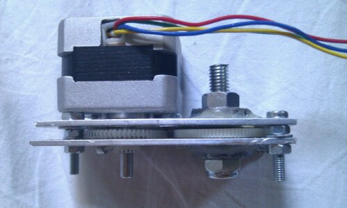
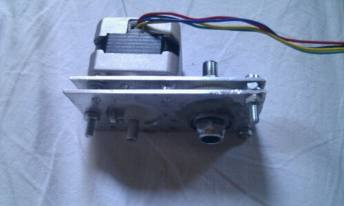

# Building a Repstrap (5): plastic filament extruder driver from scrap 

"Hey Mark, what the hell is that weird looking thing again" ? To put it simply, the extruder driver of a reprap /repstrap machine is the part that _**MOVES**_ the **_plastic filament_** that is going to be **_melted_**, using different  methods (pinchwheels, cogs, you name it).

This was the part i feared the most from the beginning , since its almost the only part of the machine (with the extruder itself) that requires really specialised/more complex parts , or so i thought!

Here is how it actually went:

### The good:

- this version you can see above was done after a bit of experimenting with all the cogs i managed to salvage from a few printers (i should call those goldmines, really)
- in the end these were the only two "compatible" cogs i could use in this design, as the one mounted on the motor's axis , is the only one i could modify to ensure that the cog does not "slide" on the axis when a lot of force is applied to it .
- the second cog (**_idler_**), is rotating freely thanks to two ball-bearings salvaged from my old roller-skates

### The bad:

- i wanted to re-use one of the stepper motors i salvaged as well, but those clearly don't have the necessary torque unfortunately
- while it works _surprising well_ with a **PLA** plastic filament, for some reason, i was **_never able_** to reliably make it work with **ABS** (another type of plastic, think legos) , it might be because of the plastic itself , the slightly larger diameter of the **ABS** filament , or perhaps simply because of the shoddy construction
- i will frankly say i don't believe this system will work reliably in the long term, so one of the _**FIRST**_ things i will **print** on the machine as soon as it works, is simply all the replacement parts for a better extruder

### The ugly:

- while you will find proof in the video below that it is indeed possible to have a working, semi-reliable extruder driver from scrap, it can never go beyond a temporary solution
- the whole thing is approximate at best, and not practical to mount on the machine itself
- if i do not manage to print out replacement parts quite fast and this mechanism breaks down, i will **_really_** be in trouble , since i would really like to avoid having to shop for some additional parts again

To give you a better idea of how it works here is another picture and a video:

 
