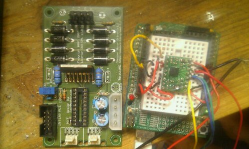
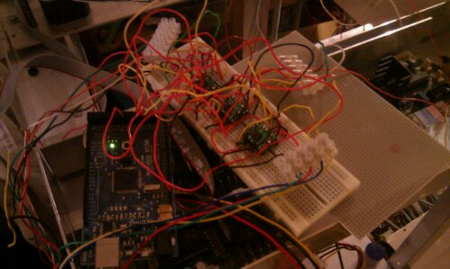

# Building a Repstrap (6): "Yarp" is now called "Doboz" Also, Stepping things up with Pololu stepper drivers!   

Here is a quick rundown on the latest changes:

- since the final stepper motor driver that was supposed to run the extruder's stepper turned out to be stillborn, and out of stock to boot, so no possible replacement, I decided to order a bunch of _**Pololu**_ (more info [here](http://www.pololu.com/catalog/product/1201)) **_stepper drivers_**. The first tests are very conclusive : _microstepping_, ridiculously _small footprint_, suprisingly less of a tendency to overheat(which weirdly enough directly contradicts what i heard about them on pretty much every site) , oh and they are much cheaper than the old drivers !

Here is a side by side with the old and the new drivers:

- I have also done an complete, but temporary wiring test with all stepper controllers, and really I will still need to build a perforated board system to hold all the drivers (this wiring spaghetti is **_really_ scary, stability wise)** , as well as adding a cooling system of sorts.

- On  more general note,  as i am getting closer to a finished machine, i decided to change the project's name: it  say hello to **_DOBOZ_** !  what does DOBOZ mean you might ask ? Well it just means "box" in Hungarian, but you can also consider it as a pseudo acronym: **D**igitize **O**bject **B**uild **O**bjectZ ( yes I cheated ;)) since it will also incorporate a _**laser scanner**_.
- As you can see partially / guess  from the above pictures, i have actually done a lot more work than is apparent in this article (working extruder and heater, lcd display etc), but that progress is sufficiently important to warant another article, so stay tuned:)
