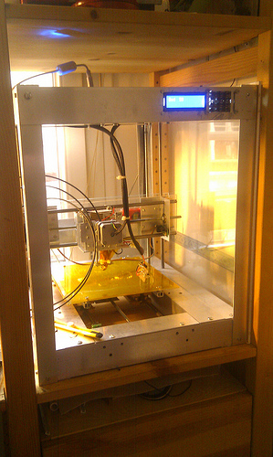
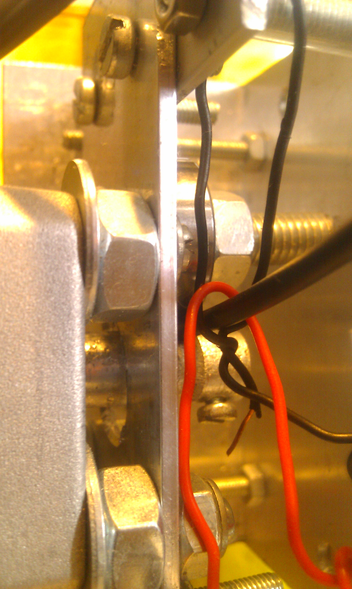
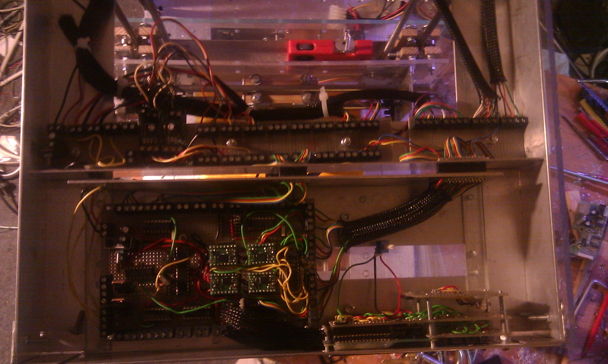
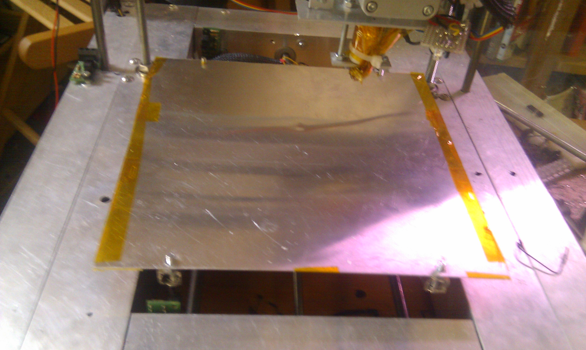
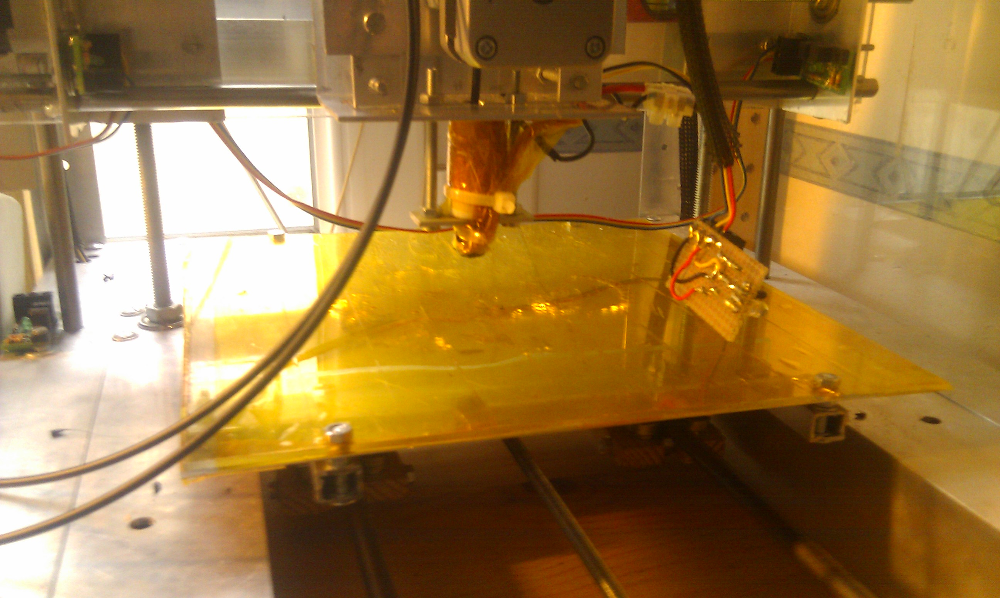
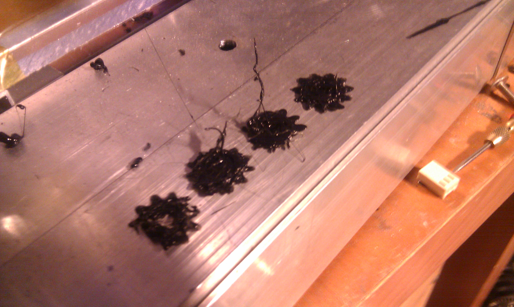
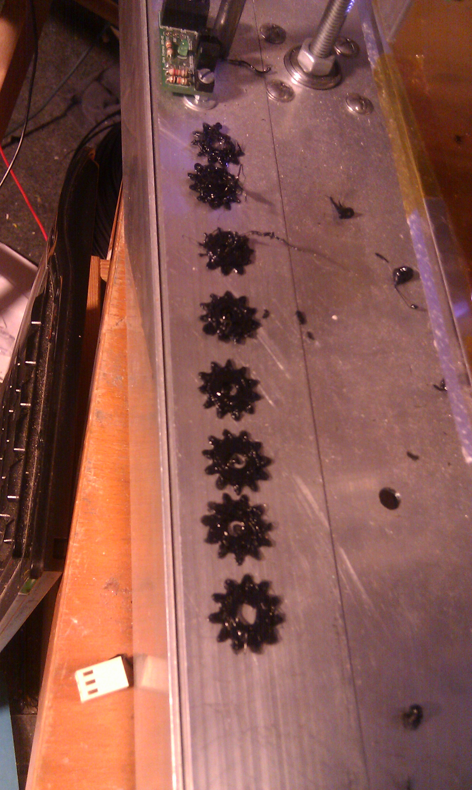
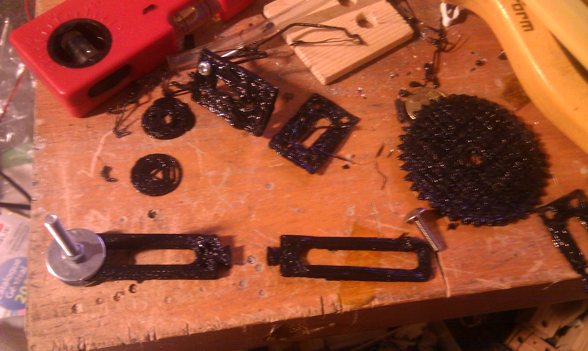
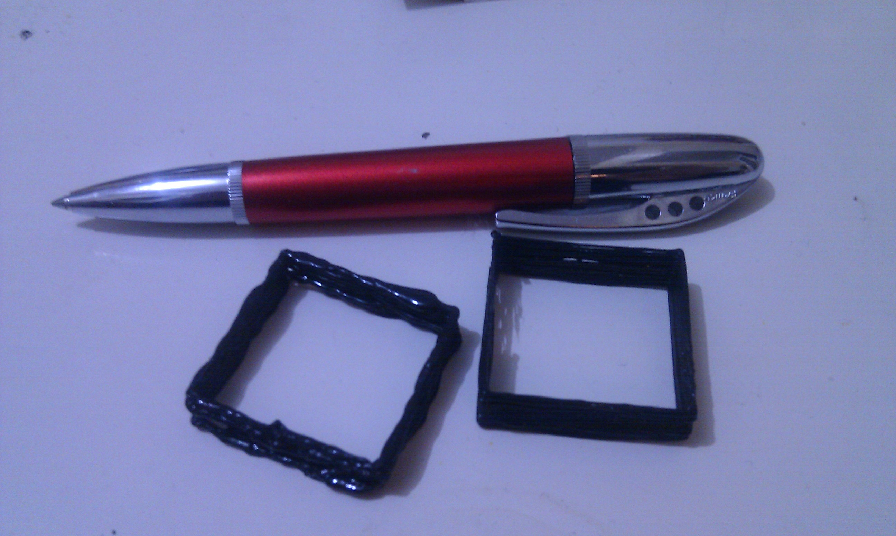

# Building a Repstrap (8) its ALIIIVE! also , improvements! 

First things first : it's **ALIIIIIVE MWHAHAHA** ! That being said: progress has been moving along a a faster rate in the last few weeks, and beside a few Things to add and adjust on the software side , the machine is 99% complete.

## Finished/improved :

- **Mechanical**:
    - the general frame is done and cleaned, some of the plexiglass side panels have been installed   
    - the extruder drive mechanism was redone from scratch 
    - the heater head / extruder broke down after a few tries and was redone as well

- **Electronics:**
    - the electronics rack and adapted connections was finished ( very practical whenever you need to make bigger adjustments or repairs on the electronics)
    - the cabling was cleaned up completely (no more "whooops i just destroyed the whole thing by accidently ripping out cables.."you KNOW it can happen)  
    - the heated bed was redone from scratch aswell, now using a set of 3 nichrome (heating) wires in parallel on the Tip120 controlled 12V pwm line, taped with kapton tape to an aluminum thin sheet and with a plexiglass (2.5mm thick) + kapton tape upper layer : temperatures can now easily reach 50 to 80 °C on demand, with a nice even temperature on the surface    

- **Software**:
    
    - a custom firmware ( based on bit and pieces from both the 5D Gcode interpreter and the Makerbot firmware) is implimented
    
    - the lcd display/ keyboard combo's software was developed 
    - The Pc side host software, in charge of reading the gcode files and sending the commands to the machine was cleaned up, debugged and improved
    - Also , what is this, could it be the premise of a **3d scan** ? 

## The results:

- lets be honest first: the machine still requires **a lot of adjustements / improvements** (mostly on the software side of things, but not only) before the print quality is acceptable
- i have been steadilly improving the build quality, adjusting parameter in [Skeinforge](http://www.bitsfrombytes.com/wiki/index.php?title=Skeinforge) (the program that converts a 3d model file into a set of commands the machine can understand and print the object accordingly) and tweeking the extruder mostly (by far the most unreliable part of the machine for now, that is why it will be replaced in due time)
- Here you can see what a bit of adjustment in Skeinforge can achieve:
    - First tries: 
    - Progressive adjustements: (those closest to the camera are the more refined ones)
- After a while i tried bigger/ more complex prints: Not quite there yet ! but getting damn close to something workable, and quality will improve greatly once i change the extruder   

And as a bonus , some videos of all these elements:

