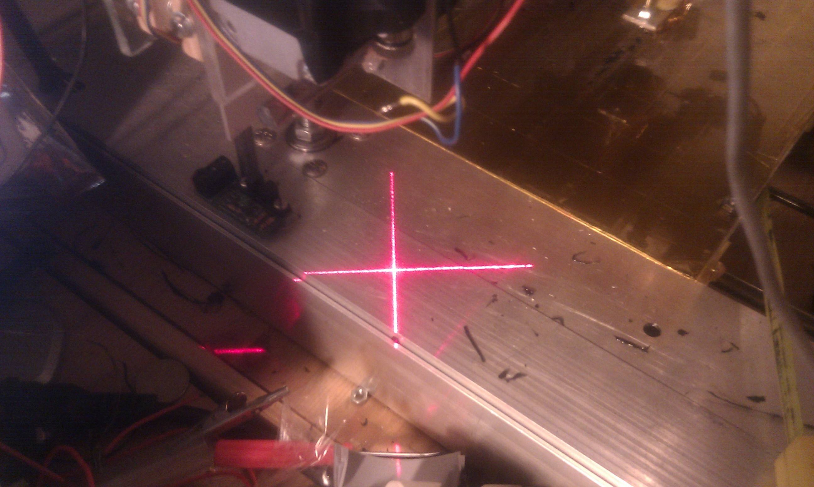
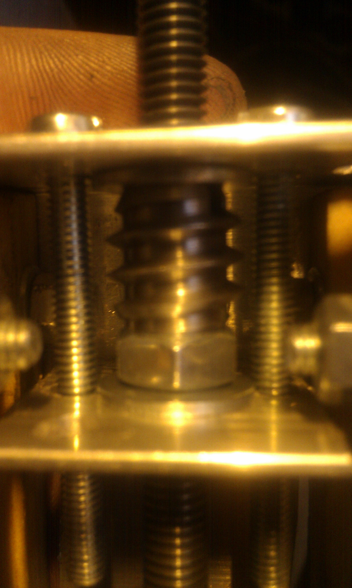

# Doboz repstrap : solving the slanted print issue  

I spent the last **two weeks** trying to find the source of the "slanted" printing (see pic above) and solve the problem (also, going insane in the process) , here are the steps i went through to get to the bottom of it:

## The problem:

- Every print, but in particular all those containing **circular elements** (very visible on this variant of Wade's extuder gear by NopHead) would be progressivelly offset on the x axis, and the problem was actually getting worse ! 
- Also , when looking back at one earlier print failure i had on a bigger gear, the problem might actually have already been present, since the **only** part that was offset on the x axis was the circular attachment at the top: 
- Giving the extreme slowness of my machine (maximum speed of **2.4mm/s** which is about **20 times less** than a Reprap, but more on that in another post) , this kind of problem is really bad, since printing takes a lot of time, and the slanting problem is only really visible and can be confirmed after around 5-10 layers .

## Methodology:

### 1\. Is it a mechanical problem?

#### a- Z axis assembly:

- **Diagnosis**: Earlier in the machine's testing phase i have had problem with the whole **X/Z assembly** becoming **slanted** , which affected the prints but certainly not in the way i was seeing now.
- **Solution**: i switched the Z axis threaded rods with higher quality ones and redid the motor couplings, then i checked for any alignment problems with a laser pointer (crosshair generator) attached to the assembly: 
- **Result** : It reduced/ eliminated the slipping coupling issues of the Z axis,but the problem  **remained** !

#### b- X axis platform:

- **Diagnosis**: During the many stages of mechanical adjustments to the extruder attachments, and due to some original misalignment of the screws holding the roller bearings  in place, the **X axis platform** had gotten **slightly loose** (the bearings not exerting correct pressure on the sliding rails), which i had fixed temporarily with .... subway tickets ... (forcing them between the platform and the rails reduced the wobble), so i thought the problem might be comming from there. Also , there was slightly **more backlash on this axis** then on the Y one, so that might have accounted for the problem too.
- **Solution**: I disassembled the platform, re-drilled the holes for the bearing screws, improve and tightened the structure to reduce wobble and i added a **second captive nut** right next to the first one, to reduce the backlash.(the weird screw like things is a special positive/negative nut)

- **Result** :While it greatly improved the quality of each layer being printed (these adjustments were long overdue), the problem **still remained** !

### 2.Is it a software problem?

- **Diagnosis**: The firmware i am using on the dual AtMega 328 chips running the machine is a rather heavilly modified 5D code , and since i work on a basis of "only use what you understand at least a bit" i have started to think that my stepper timing changes were faulty (the timing i use is nothing but a really cheap hack, without register timers...).
- Solution: Just to be sure , i decided to try a completely different firmware , which does the timing calculations quite differently, so i used a VERY trimmed down version of the HYDRA\_MMM firmware V1.4 (which is a lot easier to modify and understand than the 5d Firmware, although it does'nt (yet) support separate extrusion commands)
- Result :I spent a few hours adapting the firmware, and i made a few test prints ... the problem , as ever was **still present** !

### 3.Is it a power supply problem ?

- Diagnosis: I have had problems in the past every since i installed the new heated bed (which uses way too much power), so i wondered if it was "gobbling" up the power to the steppers, and causing a malfunction.
- Solution: Just to be sure, i did a few test prints without the heated bed, to see if things were any different..
- Result : Once again,  no change, the prints were **still slanted**!

## THE answer!

I didn't know any other thing to try, then a friend suggested simply swapping out the **X-axis Pololu Stepper driver** and that ...did the trick!! I was baffled, but i have been printing day and night ever since and have had **NO** problem at all !

So there you go , perhaps there was a glitch in the connection between the stepper driver and the motherboard, but either way, in case you run into this kind of weird problem:

- either **adjust the pot of the stepper boards**
- or s**wap the boards** out ..
