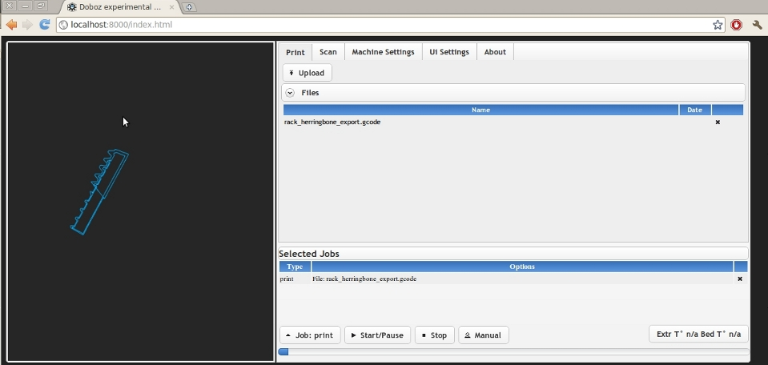
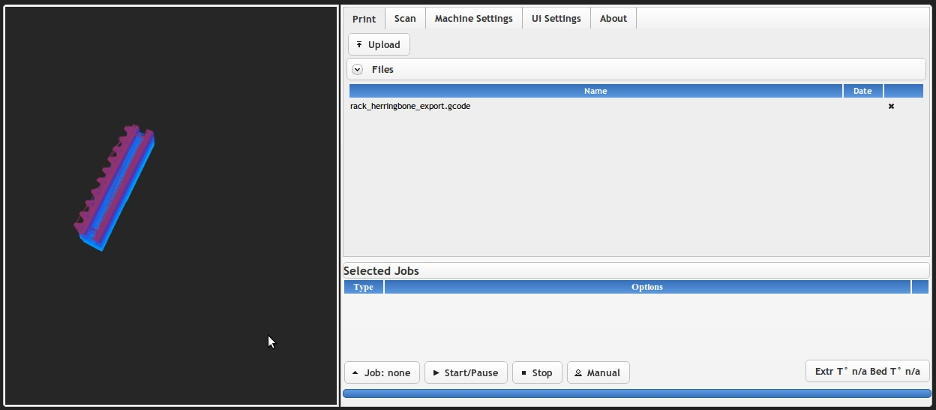
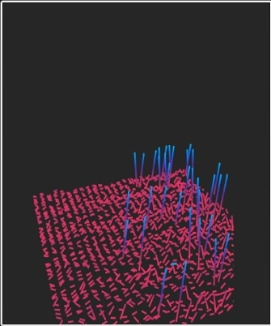
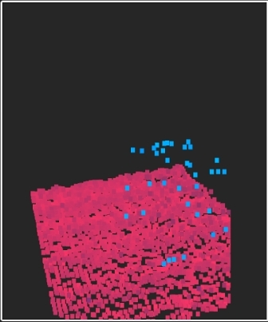

# Doboz-Web: Reprap/3d scanner remote control using python, javascript, webgl 

Up until now, the home-brew interface i was using to interact with my repstrap machine was using PyGtk , but i have had a ton of problems with gtk, (segfaults etc), oh and the ui was not windows compatible ( making gtk play nice with other threads requires some changes to the rest of the code i frankly didn't like, but hey that is just my opinion), so i decided to change my repstrap control system to a server/client approach and go "wild" a bit!  Here are the results , after the break !

## Why the change?

- it allows to decouple the interface from the actual GCode sending process/printer control completely! No more failed prints because of some UI failure
- also related : no more "oops, i accidently closed the printing program " moments ...
- remote control : start prints from anywhere ! (will be particularly useful in the future as Repraps get more automated)
- i also needed a way to integrate openGL graphics (optional) into the general interface, and with the amazing possibilities of **_WebGL_** for 3d content inside browser , it was a no-brainer (this will be used both to display the print progress aswell as the in-progress update to the 3d scanner )
- this is as multi-platform as it gets
- my other main project, the [Hydroduino](http://www.kaosat.net/?tag=hydroduino) , already works on a similar basis : a central application core, _**accessible and controllable via http**_
- Beyond the simple browser=> server communication i also needed to get realtime **feedback from the printer** , to **show print progress**  , **draw the latest axis movements**  etc

## Results:

#### Implementation details: server :

- for now i use an awfull **brute force polling** approach : send a print progress request to the server every **10 ms** ...and wait for the ajax answer (yes, ouch!)
- in the end of course that is completely insane , so i will replace it with [long polling](http://en.wikipedia.org/wiki/Push_technology#Long_polling) and/or something along the lines of [Comet](http://en.wikipedia.org/wiki/Comet_(programming)) or [WebSockets](http://dev.w3.org/html5/websockets/)
- unfortunately Bottle/ basic Wsgi does NOT support long polling (every request response is blocking) , even though i found workarounds ([monkeypatching with gevents](http://stackoverflow.com/questions/4709303/python-web-server))
- More generally, initially i was using the simple\_htttp\_server implementation for the webserver , and it was damn slow and unreactive, but once switched to [Tornado](http://www.tornadoweb.org/) , however i was really impressed ! No reaction delay, fast updates etc
- right now, because of the heavy handed approach, correct synching of multiple clients is not fully functionnal, until i switch to a better architecture
- the server side includes both the "**reprap manager"**, and the web server , for static files and ajax , and is using [Bottle](http://bottle.paws.de/docs/dev/index.html)
- the 3d scanning is still in the early stages, but works and reuses elements from one of my previous [project](http://www.kaosat.net/?p=1188)

#### Implementation details: client :

- most of the communication between the client and server goes through ajax requests
- you can upload gcode files to print directly, and **enqueue** a series of print tasks (this would be particularly useful for things like the [Thing-O-Matic](http://blog.makerbot.com/2010/09/25/announcing-makerbots-new-3d-printer-the-thing-o-matic/) or any other 3d printer that allows continuous prints
- the 3d view is implemented in Webgl, and allows you to view , depending on whether you are printing or scanning, _**the movements of print head**_ (based on the gcodes sent to the printer), or the _**point cloud data**_ if you have just scanned an object:

**Printing**: showing the movements of the print head (start)

**Scanning**: showing the point cloud of the scan, which can then be saved locally

- all of this, including the manual sending of GCodes to the printer, status and, temperature retrieval etc, is controlable from the interface (basic for now, lots to do)

**Machine** settings:

- There are also different "modes" to view the 3d data, mostly for 3d scanning (ok, and eye candy too:): it will be expanded upon in the future

- Small note: i did not go the full _WebGl_ route for the interface because of general availability /speed : webgl is quite good, but as you can read above, not that fast on all platforms, also making it mandatory would reduce the usefulness of the interface
- this was my first attempt at WebGl , and i relied heavilly on the excellent tutorials and code by Giles Thomas over at [http://learningwebgl.com](http://learningwebgl.com/)
- Using **[Jquery](http://jquery.com/)** and [**Jquery** **UI**](http://jqueryui.com/) (and a bit of [Jquery Ui notify](http://www.erichynds.com/jquery/a-jquery-ui-growl-ubuntu-notification-widget/) ) made creating the interface a breaze. Using Jquery Ui also meant easier support for styling ( for example using the very professional [Absolution](http://www.michaelvanderheeren.be/?p=382) Theme)

#### Multiplatform : hey it also works on tablets and smartphones (Android )!

Ok i confess , this is really for pure geek factor , but can also be really practical  :

- I tested it out both on a smartphone : HTC desire and an Archos 101 _**Android tablet**_ : and was very surprised to see that everything is still snappy, and with the latest firefox mobile beta, the webgl part works at "acceptable" speeds ! Call me easilly impressed, but i still feel like "the future is now" whenever i use a tablet ( yes, in the eighties, i was always "wowed" by the [padds](http://memory-alpha.org/wiki/PADD) from Start Trek, i'm such a geek :))
- Will works on a lot of browsers, except for Internet Explorer
- The 3d view can be deactivated if not needed (being experimental it is still quite buggy), or unsuported
- just for information : there are also some interesting stats about browser compatibility of the HTML 5 Canvas/Webgl [http://caniuse.com/#search=canvas](http://caniuse.com/#search=canvas)

#### The software in action:

## **Current and planned features:**

#### Current:

General:

- - **very few** **dependencies**: server 100% python , can be run with as little as the project's source code, Python 2.6 and pyserial
    - **lightweight:** the current version comes at just about 2 MB
    - **easy to set up :** static file server for the interface as well as reprap control all in one
    - **standard**: normally , it should not require you to change your reprap's firmware (except for scanning)
    - **real-time** **view**: of the current operation, whether scanning or printing
    - **easy to use**: nothing too fancy , just straight to the point
    - **multiplatform**: web based, so will work in any browser with javascript enabled (or you can send the commands directly via http from command line if you want to), 3d part requires a browser with webGl support
    - **open source**: still a very early version so feedback and participation are welcome !

Printing:

- - **upload and print:** select the file, upload the file, print it
    - **remote monitoring:** keep an eye on the print heads movement, the print progress,the temperature of your extruder and buid platform, from wherever you are, even from your cellphone!
    - **manual** control of reprap via GCodes
    - **GCode** file support
    - **multiple chained prints** via print queue

Scanning:

- - **set and scan** : just set the area and resolution of the scan, push the button and voila ! pointcloud!
    - **store and download**: the scan files are stored on the server side , and can be retrieved at any time
    - **multiple viewmodes**
    - **easy chaining:** by default, the machine will be set to home in between scans, so you can chain them without fear

#### Planned:

- - **bugfixes**
    - **more bugfixes!**
    - **compatibility increase** with other repraps / repstraps
    - **streamlining** and performance increase by eliminating brute force polling
    - **fine grained control** of the machine
    - **full control** of the reprap's settings via the interface
    - **rewrite** of the reprap manager server side for performance and clarity increase
    - **better documentation** (a bit lacking right now)
    - **better synch** between clients and server (lots of things will be moved from the client to the server side)
    - **stl support**: automatic stl-> gcode conversion  : ie  1-download a file on thingiverse  2-upload to print server 3-print ! : this is still **far** off
    - **scan & print** : scan the object and print it directly: this is still **far** off
    - **detailed instructions** on how to build the simple scanner that can be installed on most repraps (more on that in a future article)

## Download & how to:

**Downloads:**

- You can find the code here :[https://github.com/kaosat-dev/Doboz](https://github.com/kaosat-dev/Doboz)
- Or   here [http://kaosat-dev.github.com/Doboz/](http://kaosat-dev.github.com/Doboz/)

**Configuration:**

**Disclaimer:** This software is purely experimental, not even alpha stage, _**use at your own risk**_ !!

- For now only tested with **_python 2.6_**
- You will need to have _**pySerial**_ installed
- By default , the web server is set to "Tornado" but can be easilly switched to any other web server [supported by Bottle](http://bottle.paws.de/docs/dev/tutorial.html#tutorial-deployment): go to source_**/core/print\_server/print\_server.py**_ and change the initial include at the top , as well as , on the last line

\[sourcecode language="python"\]run(app=testBottle, host='localhost', port=8000, server=TornadoServer)\[/sourcecode\]

Just replace the _**server=TornadoServer**_ with the one you want to use .

- depending on your specific reprap/3d printer settings you may have to alter the configuration of the reprap-manager (in core/print server/reprap\_manager.py , since it is hard coded for now) : by default the manager expects an "ok\\t\\n"(ok+linefeed) on the end of each line returned back from the reprap to work correctly
- launch the server using python test.py
- open a browser to localhost:8000/index.html to use the interface and enjoy :)

## Looking for feedback!

It  was a fun _**two weeks**_ working on this project , and it allowed me to finally get back on track with my Repstrap machine that had not been printing for a few weeks because of those pesky software problems, so whew , what a relief !

- While it is still is very buggy , and there is lots of work left to be done,  it works quite well for my machine at least
- Given that i have no access to other repraps and makerbots for now  , if you have any input, if you are willing to give it a whirl with your own 3d printer , give me a shout , i am more than willing to make it work for other people's machine as well, and expand from the current version, feature and functionality wise
