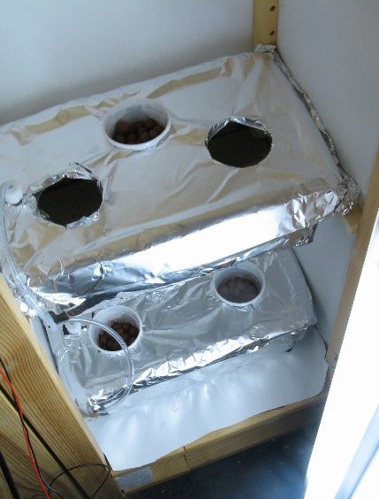
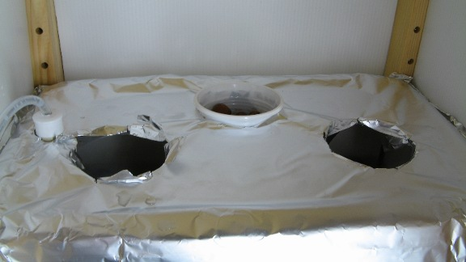
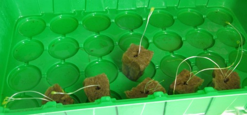
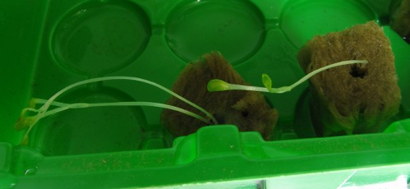
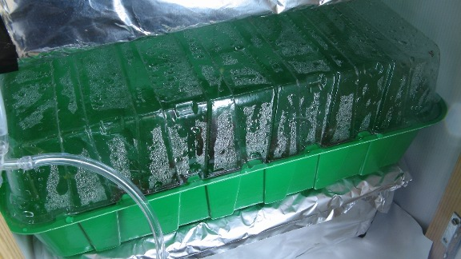
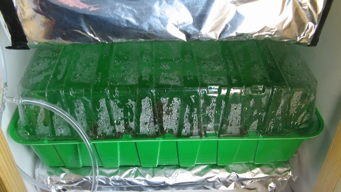

# Dwc (Deep Water Culture) Setup finished 

Sooo,  finally took the time to finish the dwc part of the system:

- In this last step i wrapped the two containers in aluminum foil to make them 100% lightproof

- I did a few test runs with the lighting (2\* 13W fluorescent), and although the shelving barely became slightly warm to the touch after 7 hours, i am all but reassured security wise ... (don't want to start a fire)

- i realized i should have transfered the seedlings WAY earlier (without removing them from the mini greenhouse for now) because they have grown all bent and thin (Photo tropism at its best)

- hopefully i can still salvage them though!

The plants right after transferring the greenhouse:

The greenhouse in place :

Still not to sure about how this will turn out , but well, trial and error..
