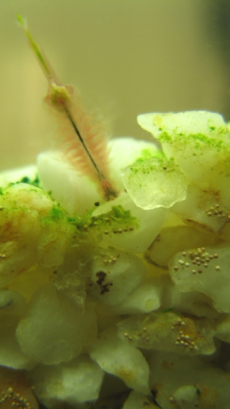

# Ecosystem Simulation - Artemias(1) 

## 

## Foreword

A little over a year ago i spent about 3 months working on a small "aquarium/closed ecosystem/artemia salina"  (brine shrimp) simulation.

Basically i wanted to try and improve my programming skills in c# aswell do something a little bit different, and all tied together with my passion for [closed ecosystems](http://en.wikipedia.org/wiki/Closed_ecological_system) and [Artemia Salina](http://en.wikipedia.org/wiki/Brine_shrimp)...

## Aims

- The aim was to have a semi-edutainment program,  using actual scientific facts and observation (from the live artemias i had), that could also be used for a bit of relaxation ( watching artificial creatures move around, feed, reproduce die etc)
- I also wanted to try a (for me) new method of programming so i based it all on a component based system.

## What went right:

- It is the first project that i can actually claim was "finished"  in some way!
- The project actually worked in the end, although it was far from finished,  and buggy and limited as hell
- I think i learned more doing this project, and explored new ways of programming and understanding than in all of my other projects
    - i learned or relearned a lot in maths and physics
    - i increased my limited grasp of opengl
- This project actually spawned a ton of other ones (more of that later) which **all** worked  individually , but which i failed to integrate into the main program in the end
    - Heat propagation using Cellular Automata :  [link](http://www.kaosat.net/?p=225)

## How it started:

- At that time i had a 30l aquarium running exclusively for the Artemias/brine shrimp/sea monkeys , which lived and thrived nicely: believe me , an "artemia ballet" is quite an interesting sight (they spend a lot of time swimming on their "backs" to,  if i remember correctly , improve their nutrient uptake)
- The more you know about them the more fascinating they become: very sturdy creature (production of long "lived" cyst in case of diminish water/oxygen levels, increased production oh hemoglobin in less oxygenated levels etc)
- As their name indicates, Artemia Salinas (and some other similar varieties) , live in water with very high salt levels:  this restricts their ecosystem to something relatively simple , and thus i thought it would be a good idea to start with a simple simulation

