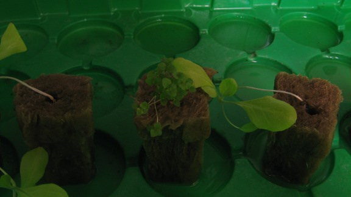
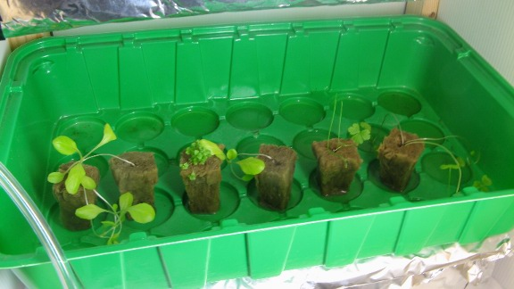

# First growth tests : week 4 ! 

Not much to report: plant growth is starting to accellerate, the roots are starting come through at the bottom of the rockwool cubes (mostly for lettuce), so it will soon be time to transfer the plants into the dwc system .
