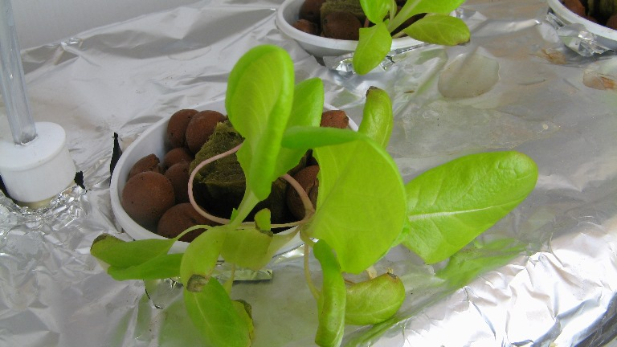
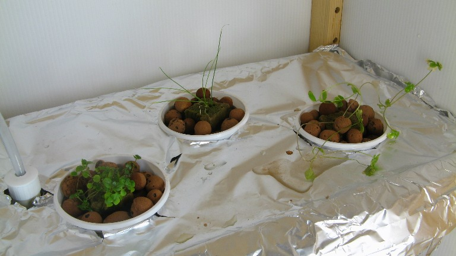
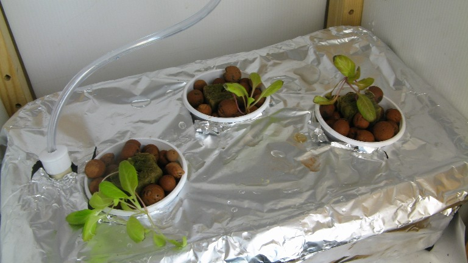
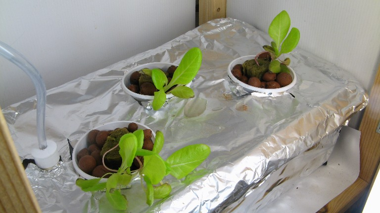
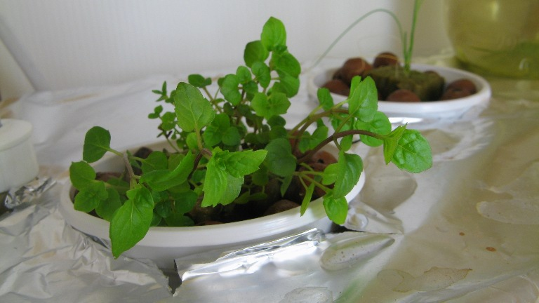
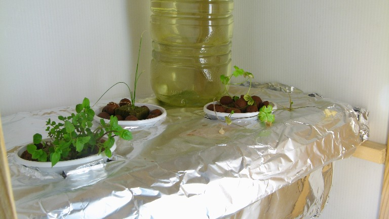

# First growth tests : Week 8 and 9 

Has been a while since i posted updates on the dwc hydroponic garden, but here are some photos taken on week 8 and 9 respectively, and some additional information:

- week 8 beeing the week when i transfered the plants into the system ( it was almost too late, as they were starting to wither)

- week 9 is exactly one week after the transfer, and most of the plants are doing great : very fast growth rate , greener leaves etc. The ones having a bit more trouble are those who had the less developed root system at the time of the transfer. Lettuce and peppermint are the ones that seem to like the new environment the best

- The system only uses the water from an aquarium ( i filter out the bigger particles with a simple coffee filter ) , no chemicals whatsoever are added.
- A simple aquarium air pump is switched on automatically for about 15h per day, and is oxygenating the roots directly through standard aquarium air stones
- The lighting : two 13w fluorescent lamps mounted in vertical position to optimize space
