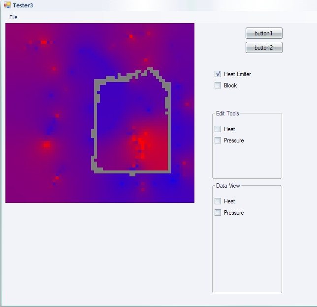

# Heat and pressure propagation using cellular automata 

This was a short project meant to be integrated with the core [Artemia Salina ecoystem simulator](http://www.kaosat.net/?p=67)

Done in about one day, and then refined further before comming to a full stop

- Was meant to simulate regions with different temperature levels inside an aquarium, and would have been used by the creatures AI (different "preferences" of temperature for different creatures,  behavioural modification or even damage to the creature at extremes etc)
- I never managed to get the pressure part working correctly (or at least, credibly), as my understanding of fluid simulation is close to inexistant:)
