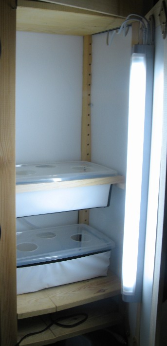

# Homemade Hydroponics(2) Dwc (Deep Water Culture) Setup 

### **Introduction:**

This is the second type of hydroponics system i decided to setup:  it was almost the cheapest  to build,

and it certainly seems like the simplest, and more reliable one to make (no water pump required).

You can find more info on Deep water culture [here](http://en.wikipedia.org/wiki/Deep_water_culture "Dwc-Wikipedia") Or here

### **Parts:**

\-One or more cheap plastic containers (bought these 5 L ones for 2.50 euros)

\-Saw to cut out the lid (i used a 60 mm one, standard plastic cups fit right in) (5euros for a set of 6 different diameters)

\-Air pump : standard aquarium air pump (around 20-30 euros for a Rena pump)

\-Air Stones : amazingly , the most expensive part since you get about 4 for 5 euros (might want to find some for less on ebay)

\-Basic plastic cups : you will need to drill/melt a few holes and cut the sides a bit to let the water and the roots through

**_The rest of the list is purely dependent on your specific needs:_**

\-Depending on whether you will be  doing your culture indoor or outdoors you might need some lamps ( i just bought some relatively cheap (19 euros) 13W/50 cm fluorescent tubes, not sure on how fine that will go , but well)

\-I also had to build a door and some walls to provide some protection of my tiny flat from water projections/ isolate the grow box a bit

\-Since the plastic boxes i got were transparent, i also had to make sure no light would come through, so i covered them with some rather thick plastic foil (if you find an opaque box that fits your needs, obviously this step is useless:)

### **The result**:

So i have divided my available shelving place (30\*35 \*180) into two compartments :

\-upper shelving : see first part : for the ebb and flow system

\-lower shelving : (30\*35\*80) this is where i setup the dwc system :

Close Up:

### Problems:

I went through a bit of trial and error, and tried to make a maximum use of what i had in hand, so it is far from perfect:

\-The air pump , however silent the manufacturer claims it to be, is still too bloody noisy for a flat as small as mine ( the air pump is aproximatly 1m away from my bed!), and i still havent found a way to reduce the noise completely

\-The air piping that goes through the lid was not a wise decision i guess : while it isn't too hard to remove, it would have been better to make the piping go through the top of the side of the box instead, to reduce any risk of hurting the plants during maintenance

\-I did not really have a choice given the limited space i have, but still, these plastic boxes can contain only 5 l of water, which is pretty lousy
