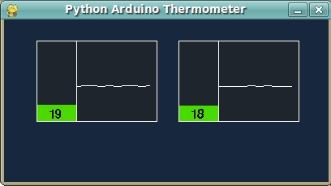

# Hydroduino: Arduino multi thermometer (Processing vs Python) 

Since i recently started learning Python, i am trying to "re-write" (based on the algorithms , not literal rewrites) of a few programs i did in c# and Processing, and this is basic temperature monitor. More info, processing applet, and code below.

So what did i do  ?

- cleaned up the original multi LM35CZ based Processing project i did a while back
- decided to try to write something similar in python
- the aim was to get the overall visual aspect as close as i could to the Processing program, and that worked out better than i hoped
- this (or an updated form of it) will be part of the hydroduino project for environmental monitoring and control

The Processing applet:

**Source code:** [Processing :arduino\_thermometer\_0\_02](http://www.kaosat.net/applets/arduino_thermometer_0_02/arduino_thermometer_0_02.pde) [Python :PyThermo001.py](http://www.kaosat.net/downloads/arduino_thermometer/PyThermo001.py)

A few important things though:

- of course as there is no Arduino connected to it, the applet presented above is just displaying fake randomized data
- The python code is a lot more complete, reusable and object oriented, hence its slighly bigger complexity
- A secondary aim was, not to change the code Arduino-side, since a different in the program displaying the data should have no impact on the device sending it (better decoupling)
- The python version uses PyGame and PySerial as its backbone
- Code is gpl unless specified otherwise. (feel free to use anything you can salvage:)
