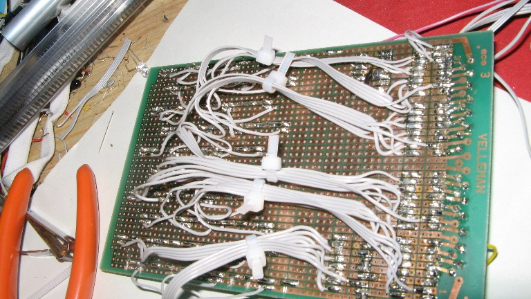
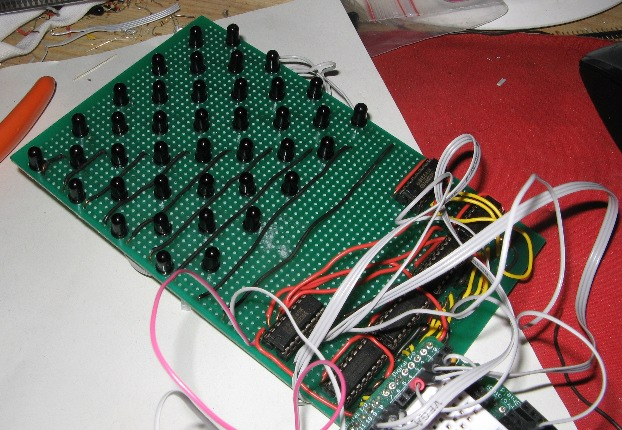

#  Ir Multitouch Prototype 2 

Without further ado : here is the latest update in the ir photodiode based flat multi touch screen project

[Ir\_MultiTouch Prototype 2](http://vimeo.com/4772078) from [mark "ckaos"](http://vimeo.com/user1581901) on [Vimeo](http://vimeo.com).

More info and another video after the break

\-Some pictures of the prototype: (it's 8\*10 cm )-As you can see , even with "only" 40 photodiodes, it was a bit of scary to solder

[Ir\_MultiTouch Prototype 2 Reactivity](http://vimeo.com/4772409) from [mark "ckaos"](http://vimeo.com/user1581901) on [Vimeo](http://vimeo.com).

More info:

**Hardware**

- I use a staggered grid configuration for the layout of the photodiodes
- I use a 74hc238 chip for two columns of photodiodes
- The photodiodes are powered sequentially
- And even more info:
    1. the setup is/will be endligten based/dsi (it works) although i cheated in this video i just inverted the data from the “IR Shadow” of my hand ( i accidentally ripped off the wiring from the IR Leds earlier today :( but if anyone wants proof i have a video of the V1 prototype working with endlighten)
    2. the endlighten will be used both as IR Diffuser AND back-light, although that requires some more adjustment to work smoothly with this prototype (using an op-amp amongst other things ), but i can confirm it works.
    3. the whole system is about 4-5 cm thick (including screen , box, everything)
    4. the sensor matrix itself is about 1cm thick

**Software:**

- this data is then sent to openCV for blob detection
- I developed my own experimental tracker for processing , using openCV ( the tracked blobs are surrounded in green, on the right side of the screen)
- in the videos above , it runs at 120fps although it might not seem that way since my camera doesn't film that fast
