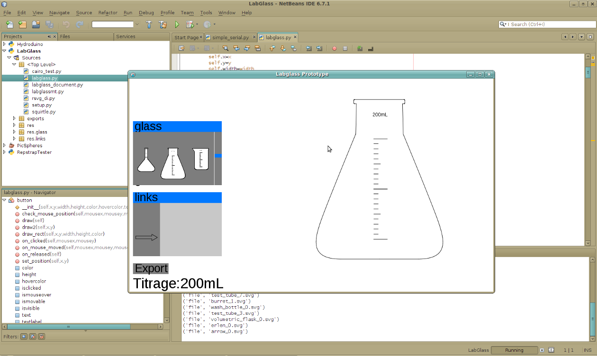

# LabGlass: a tool for chemistry/laboratory glassware experiment schematics

Recently in my biochemistry studies , i needed to do a series of laboratory experiment schematics , after looking around for standardized lab glassware drawings and related tools,  i said to myself "why not make a useful tool out of it, since there is not much done in this area" more, download etc after the break.

So i "hacked together" (really done over one two days)  a very basic and preliminary tool to generate this type of graphics.

**_Edit and foreword:_**

This was an article and project i wanted to post about a year ago (yikes) , so its quite outdated, and haven't had time to work on it more, and keep in mind, this was one of my first projects in Python, hence the dirty code.

## **The (very short) feature list:**

- displaying of  the different glassware/lab equipment i created in Inkscape
- allows you to change the text of the amounts contained within the different glassware.
- 100% python
- svg rendering using [Pyglet](http://www.pyglet.org/) and a modified version of [Squirtle](http://www.supereffective.org/pages/Squirtle-SVG-Library).
- export to svg and png formats (using some elements of [pycairo](http://cairographics.org/pycairo/))
- multi-platform (tested on windows and Ubuntu)
- small size

Since a lot of people seemed interested in a tool to create such schematics but with a lot more features,  this will likely become a major project over time, the final version should enable people to create schematics such as this one (text in French only , sorry):

## Downloads :

You can get the experimental version [here](http://code.google.com/p/labglass/)

I also have quite a few ideas on its usage with multitouch technology , and some interesting possibilities for educational purpose. Feel free to comment, feature ideas are also welcome!
