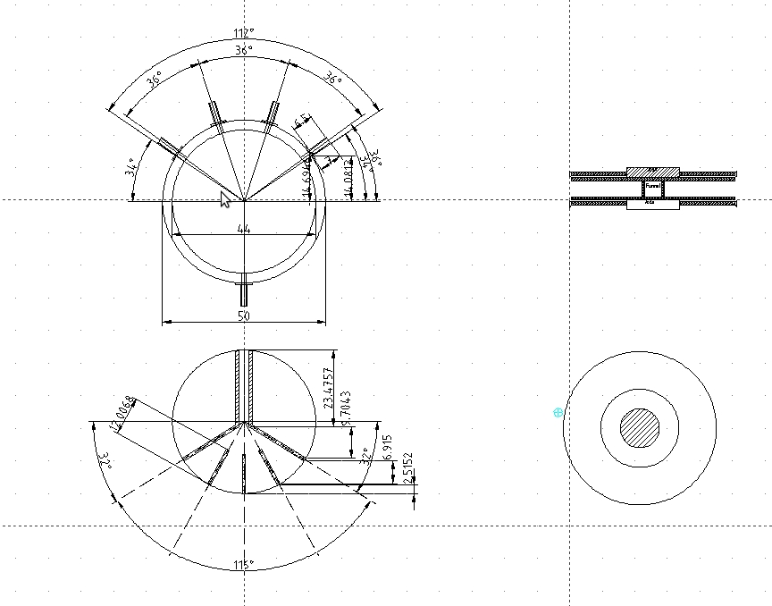
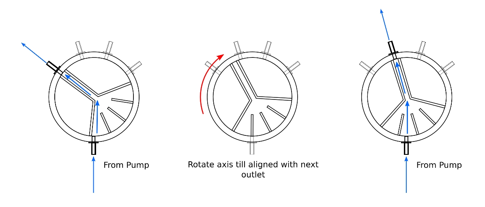
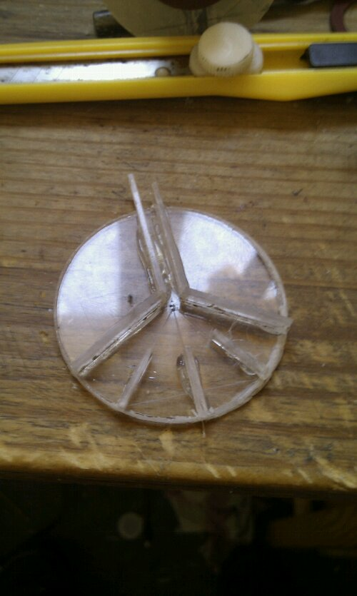
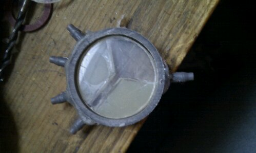
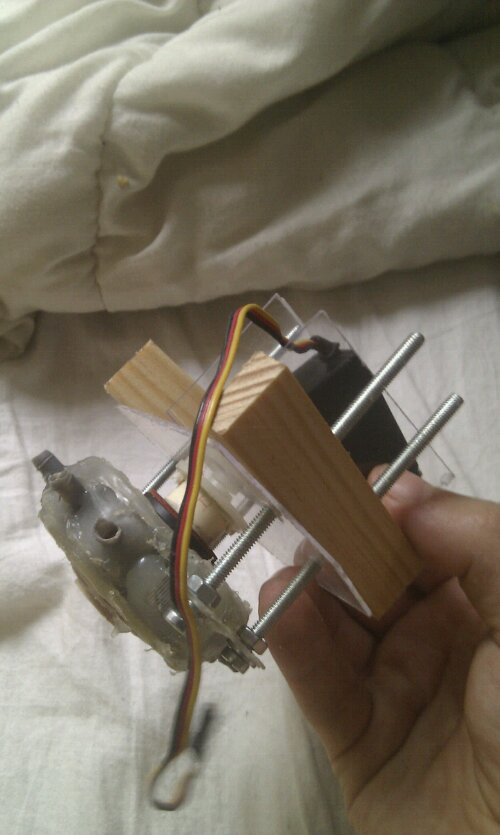

# Multivalve system for HydroDuino 

In order to have a better level of control for the water distribution in the different containers for my hydroponics automation , i though of using many different systems, using a set of servomotors and modified gardening valves, but in the end came up with a small and cheap to build "device", using only a single servo and easily available materials.

The device needed to take one water input, and allow to choose an outlet selectively , so I came up with the following design and working principle:

All you need to build it is a small pvc pipe section, some old cd boxes, a few joints and a lot of hot glue! ( and a few tools of course).

The servo is connected to an arduino , and will be automated using the Hydroduino remote monitoring and control system (more on the progress on that part soon).

Now, of course its far from perfect so there are some problems that still need to be ironed out :

- since I chose a somewhat too small length of pipe for the outer housing, the inner pressure is far too great resulting in quite a lot of leaks, and water going into the hoses where it should not ( although, because of the pressure difference , this is not really a problem right now, since the pressure is still significantly higher in the correct outlet) .
- it is quite hard to balance the fact that the inner , rotating ring need to have a tight fit, to minimize leaks, with a sufficient "looseness" to enable the servomotor to rotate it without problems

Any suggestions on improvements, or comments in general , are of course more than welcome :)

Ps : here are some pictures of different elements, and the still work in progress servo mount:

