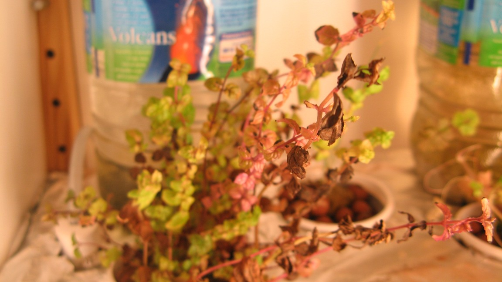
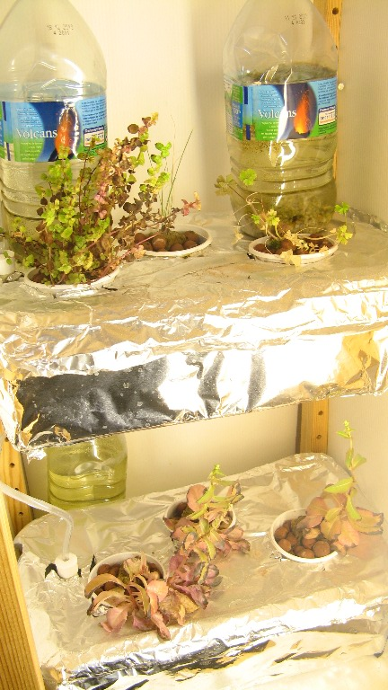
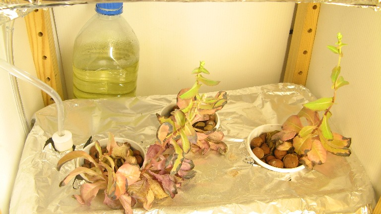
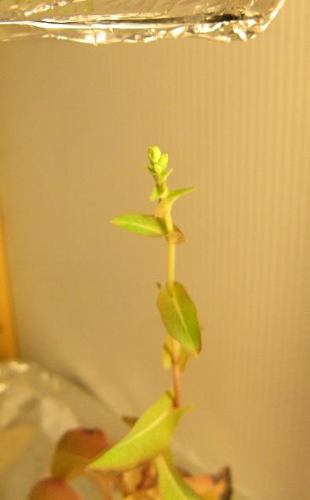

# Projects update : learning from mistakes(1) - Hydroponics 

 It has been a while since i updated any of the project pages, due to a series of rather bad turn of events at the start of the summer , but fear not, here is a rundown of the status and upcoming changes to all of them:

## **Hydroponics**

**V1.0: Quite a bit of a failure:**

_**The bad:**_

\-as the system i used to filter out and renew the water was **very clunky** (all manual, slow, and unnerving) ,  and because i was absent for a greater part of the summer, a lot of the plants slowly shriveled away , but not completely: surprisingly as you can see in the pictures below, even though the salads' box had nearly no water left, they actually stayed "alive" and are even close to **flowering**!

\-i did not have the time to work on the ebb & flow system and the [**Hydroduino**](http://www.kaosat.net/?tag=hydroduino) , so i only had half of the initially planned plants

**_The good:_**

\-i still find it amazing that with hardly any care , ie :

- no water renewing for over 3 months
- minimal power usage and maintenance
- no added fertilizer

That the plants managed to survive for this long : when full the grow boxes are filled with approximately only **4.5 L** of water taken from the aquariums:  i did **not** refill any of the containers for the last **3.5** months.

\-the overall costs still remained very low, and with a little more care and adjustment, i am quite sure the plants could thrive

**V2.0:Upcoming improvements , changes and more:**

\-for the DWC system (pictured above):

- i will make small changes to the refill system, possibly using a pump and diy filter system to make water refill & exchange a lot easier.
- a new batch of plants needs to be put in place, post cleanup

\-for the ebb & flow /hydroduino system, the aim is still close to 100% automation:

- the Arduino controlled pumps need to be set up , in a safe way (minimal risk of pump or electronics burn out etc)
- lighting will be exclusively led based (see [here](http://www.greenpinelane.com/) for examples)  so the electronics and general led assembly needs to be created
- i also need to setup an environmental data logging system (at least for temperatures for now, later for pH as well) which will likely be connected to a low power mini itx based computer (with http access for remote observation and control)

If you have any advice or observations about what has been done or what is beeing planned, don't hesitate to leave a comment or a message! :)
