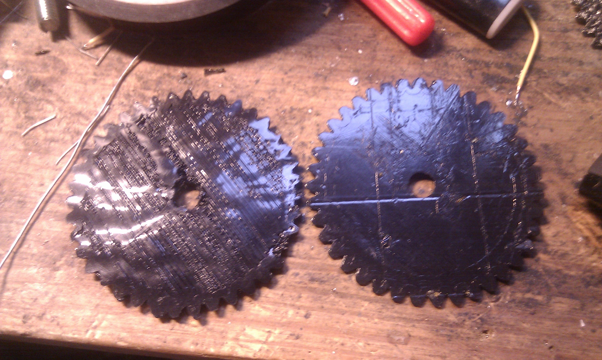

# Repstrap Improvements, also kaosat.net now on Twitter 

 Hello everyone !

After spending days trying to figure out why in the world i was having problems printing small details on objects , but no issues with bigger parts , i had a "eureka" moment last night (or a "facepalm" moment, it depends).

- It turns out i was silly enough to **shut down the steppers** between each GCode command line (the commands telling the machine what to do) which of course allowed the filament to slip ! (a stepper without power has no torque, so it simply was letting the plastic filament **slip all the time** between commands). So i updated my firmware to only shutdown steppers after a timeout : and voila !

Here (and above) is the same gear, before and after the software changes.

- In completely unrelated news, you can now follow me on twitter :

[http://twitter.com/kaosat\_net](http://twitter.com/kaosat_net) In due time , i'll add a twitter icon to the site aswell.
