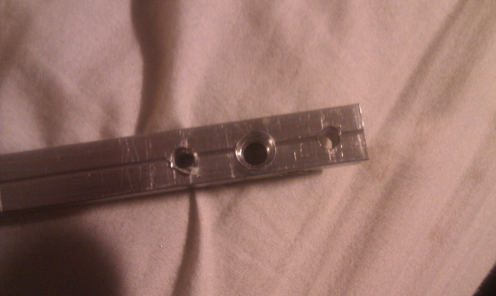
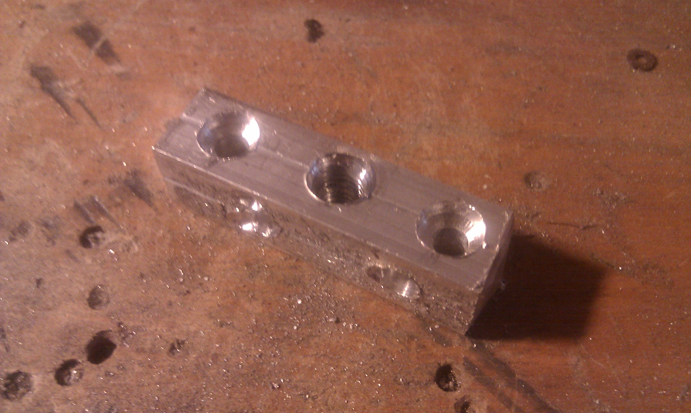
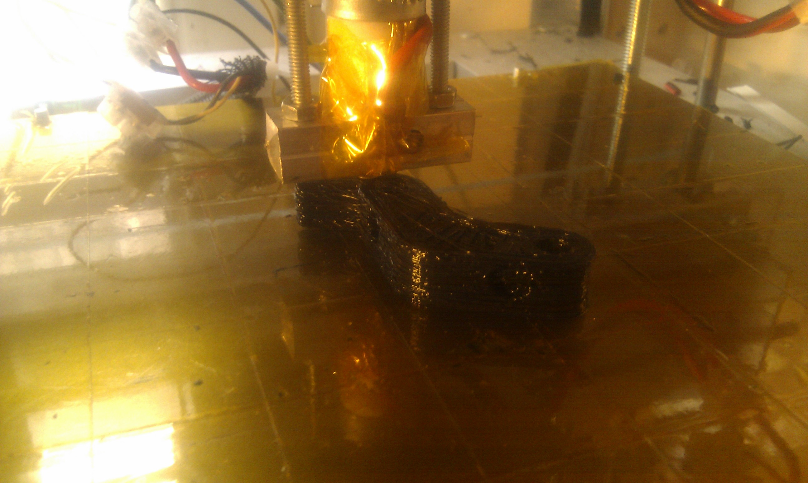

# Repstrap/reprap: from nichrome wire to heater block 

The nichrome wire extruder heater on my Repstrap finally died after working really fine for over a month ( and being dipped completely in molten plastic a few times, thanks to a few z axis adjustment blunders...) . It was time to switch to an aluminum heater block/ vitrous resistor combo for much improved reliability and longevity! It was surprisingly easy and well worth it in the end: it is just **NOT possible** to have a long term reliable heater with nichrome wire, as:

1. the windings will always come out **differently** (so every rewiring will be different, and require recalibration)
2. it can be **hard to attach** it to the heater barrel
3. it **degrades** with time (seems to ge brittle and sometimes snap)
4. it **cannot** be **soldered** !

So here is a step by step building/assembly guide in case anyone needs it:

General notes:

1. I used a special drill that drills and taps at the same time: while it might be slightly more expensive than the usual drill heads, its really way more practical than using seperate drills and taps.
2. I used two **vitrous, 3W, 6.8 ohm** resistors

So the construction itself:

- first : mark the hole placements

- drill/ tap the main hole 

- drill the mounting holes ( this might no be necessary if you already have an insulator block) 

- drill the holes for the the resistor(s) : In some of these pictures you can see only one place for a resistor, but after some tests it turned out that it wasn't quite sufficient, as getting to around **180 C** took **over 7 minutes** (yikes, indeed) and the heater could not go beyond that!! I blame it on the rather large block I used: more surface area means more useless heat dissipation! Adding a second resistor in parallel solved both of these issues completely.

- if you choose, and your heater block's size allows for it, you can also drill an additional hole for the thermistor, or you can put it closer to the nozlle and paste it in place with Kapton tape
- i also did some counter sinking for the attachment screws in order not to have them stick out too much near the bottom of the block,and interfere with printing 

- cut the aluminium block to size ( I usually do it after the drilling, as the final block is relatively small, and maintaining it while drilling would not be practical)
- mount the block on the isolator/ barrel assembly: since the central hole is already taped, it screws right in! 
- put the resistor(s) and thermistor in place, and attach the resistor's leads together if you use more than one. Then, solder the cables to the leads of the resistor(s) and  remember to take the different cables final positioning into account 
- be careful to isolate the soldered ends from the block, preferably with kapton tape to have both electric and thermal isolation
- do the same with the thermistor ( put in place, solder, isolate), it migt also be a good idea to attach the cables to the isolator:

And there you go, one finished heater block ! I had never done one before and it took me less than hour from start to finish so as i like to say "if i can do it ,anybody can do it ":) Now you can connect, test and **calibrate it** : very important to go through the printing callibration process again, as a new heater will behave differently, it took me an afternoon to adjust my Skeeinforge setting to get back to the level of quality i had before  .

And then , use the new heater, and  watch your house **go up in flames**! Joking of course, the heater block approach is no more no less dangerous than the one using nichrome wire!

The brand new heater beeing used to print a "Huxley" Reprap vertex (foot if you will) : _**it works**_!

