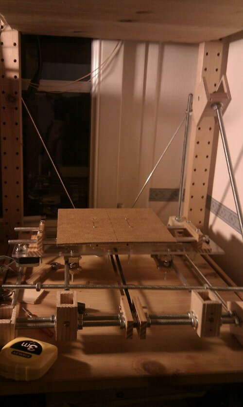

# Building a repstrap (1) : YARP: Yet Another Repstrap Project 

In the past months I have gathered the different parts needed to build a Repstrap/low cost cnc machine, and recently I finally had time to start building the machine!

# **Reprap/Repstrap, what is that again ?**

Of course, not everyone might know what a reprap/repstrap is :  the official site has a very good explanation [here](http://reprap.org/wiki/Main_Page) , and the wikipedia [article](http://en.wikipedia.org/wiki/RepRap_Project) is quite complete aswell .

Basically its an **_open source 3d printer_** , ie, just like you can print text with a standard printer, with this type of device you can actually print (generally plastic) **_objects_**!

I could go on for ages about the endless possibilities of such machines , the more you know and think about them, the more you see what they are able to do , even at the relatively early stage in their development, the more amazed you'll become !

3d printers have actually existed for quite a while,  but they were very expensive , commercial, and closed (as in not open source), they have just become accessible for us mere mortals in the last few years, and their evolution , the different experimentation people are doing with them, are quite staggering.

A Rep**Strap** works along the same lines as a Reprap, minus the self replication, and a generally different type of structure/construction.

# **Why do you even need such a device?**

Many reasons actually !

- For more and more of my projects, i have been needing specific parts which are either not easily obtainable , too expensive, or simply do not exist ([things](http://www.kaosat.net/?p=850#more-850) of my own design etc).
- Building such a machine teaches about a lot of different fields: stepper motor control, mechanical engineering, specific programming etc
- You might have seen me mention my interests in biology and biochemistry and bioinformatics :there has been a lot of research going on in printing replacement organic tissue or even organs! no , i kid you not : here is a video about this aspect of 3d printing : [www.youtube.com/watch?v=80DhBLEhdzk](http://www.youtube.com/watch?v=80DhBLEhdzk) depending on how things go, this is definitely an area i will explore

# What is this "YARP" you are talking about ?

"**YARP**" is for "Yet Another Repstrap Project" , since well, everyone loves pirates, Simon Pegg, and there are a lot of different type of repstraps already.

It is actually going to be a cnc machine aswell : in the first stages, before i build/buy the plastic extruder, that will be its main function to be precise.

It started out with these objectives :

- modular design, to enable me to test different approaches to the axes (rod, belt driven, different axis configurations etc)
- i also wanted to keep it as **low-cost** as i could
- and  somewhat"**eco-friendly**" (promoting reuse of old equipment etc) although, as you'll see in a future article, reusing pieces of old hardware can make things a bit complicated and less reliable

To sums things up, a little Fact sheet :

- The electronics are generation 1 , from a German Reprap shop ( chicken and egg problem: I had no way to create circuit boards )
- all of the stepper motors and most of the mechanical parts are salvaged from old printers ( this imposed certain limitations of course , since I had to make do with what I had on hand )
- Estimated costs : around 150 euros
- Build area : W:200 x L:200 x H:80 mm
- Construction time so far : 3 weeks

This is the first post in a series, as i intend to increase the number of my articles, and this specific project was very iterative, so expect news on this front, quite often!
