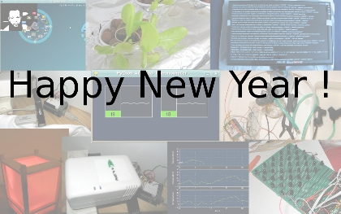

# 2010, the year we make ...more projects 

I have been quite busy in the past few months, and did not really have time to post  updates on the older projects or mention the new ones but here is a quick run down:

- sheevaplug : yep,  after looking around for a very low cost server sollution , a friend mentionned this article : [link](http://arcfn.com/2009/06/arduino-sheevaplug-cool-hardware.html),  so  i bit the bullet and bought a [Sheevaplug](http://www.marvell.com/products/embedded_processors/developer/kirkwood/sheevaplug.jsp) (ordered at [NewIt](http://www.newit.co.uk/) ):  it was a bit tough at first, having never worked with a headless server before , but in the end  i learned a great deal, so it is now runing debian  from a 4 gig sd card, and a wifi dongle aswell as an arduino are connected to it: this leads me to the next point

- the hydroduino : you might have guessed it, it will be connected to the sheevaplug (for web acess  and data storage amongs other things) i have continued working on the code aspect of the project (serial listener system, lightweight database integration using sqlite etc) , still in python : expect some big updates soon

- gui / interaction methods:  in my man machine interface class, i was tasked to work on some original photogallery, with original methods of interaction beeing a bonus , and it had to be coded in Processing, as per instructions: here is a result of about 10 days of work and experimentation: [PicSphere + object tracking](http://vimeo.com/7998809) from [mark "ckaos"](http://vimeo.com/user1581901) on [Vimeo](http://vimeo.com).

So , happy new year to everyone , thanks for all those who gave me feedback on the projects and inspired me to do more, and good luck for all your projects!
