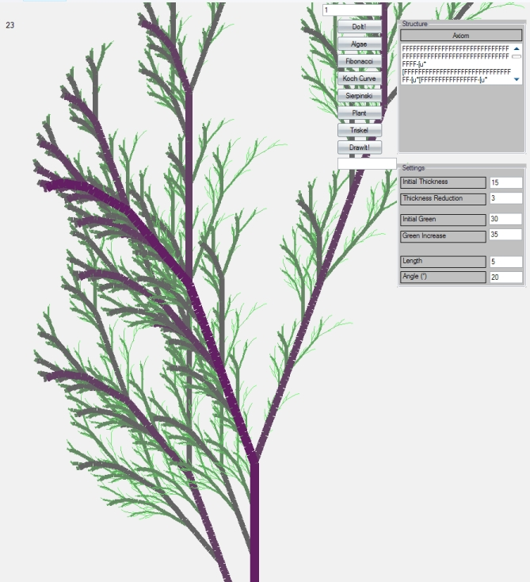

# L Systems in c# / mono 

## A quick try at L-Systems:

A few weeks ago, i stumbled on the [wikipedia page for L-Systems](http://en.wikipedia.org/wiki/L-system) (oh, wikipedia , even for all you faults, how i love thee).

So i decided to do a quick (less than a day)  implementation in c# .

This was the result after about another day of improvements:

Things of Note:

- I added a few extra things compared to what is found in the wikipedia article:
    - Color changes based on "generation"
    - Thickness changes base on "generation"

- It is only for basic LSystem: context free, and  not procedural (although, i confess, i did expermiment with more complex version, but those really are to slow for showing)
- 2d Only
- Windows only, although i am currently working on a Mono version (but boy am i having problems with GUI)
- The improvement version also uses multithreading , and the speed increase, even on just an old dual core amd, is quite amazing
- I will post a download link soonish so you can try it out for yourself
