# Asus 16 " VW161-D LCD screen disassembly 

[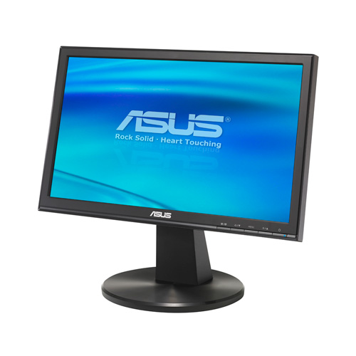](./assets/original.jpg)

This is a step by step guide (with pictures) for disassembly , for anyone having doubts about pulling appart an lcd to use it in a DIY project. The pdf is [here](http://www.kaosat.net/downloads/AsusVW161Disassembly.pdf) Or you can read the html version after the jump **Foreword:** Since a lot of people seem to wonder how to disassemble an LCD screen for reuse in different DIY projects i though i would put this step by step disassembly document together :

\-i used a brand new 16 inch Asus screen since these are amongst the cheapest ones, and quite easy to find ( costs 63 euros here in France) : link to the screen description: [http://www.asus.com/product.aspx?P\_ID=0NACweKzmwTOsIZJ](http://www.asus.com/product.aspx?P_ID=0NACweKzmwTOsIZJ) -I confess i found the idea of pulling a brand new piece of equipment apart a bit daunting, so hopefully this step by step will reduce your risk of going into cardiac arrest in the process:)

If you have any feedback do not hesitate to contact me at: admin at kaosat.net And please be careful : don't injure yourself in this process!

**Tools:**

-a set of small flat and cross head screwdrivers of different size

\-small pliers (to unscrew the vga connector)

\-a flat, unclutered environment sufficently large to put the screen down on

\-time : do not rush it, be carefull and observant and thing will be fine : in almost all the steps you do not need to exert any physical force , so if something seems to resist, don't force it, check if anything is still connected, or if there are still screws in place somewhere

**Disclaimer :**

**-Disassembling an LCD screen voids your warranty and is a slow and delicate process : do it at your own risk!**

**-I take no responsibility nor will i be liable to damage to the screen or yourself : you do this at your own risk !**

**-DO NOT plug the screen in before disassembly , or if you did , wait a few hours after having it disconnected from mains since there are capacitors in the screen power supply that can remain charged for a while and those are VERY DANGEROUS!!! once again, you agree to do this at your own risk.**

**\-Work in a well lit, unclutered environmentTake your time  and it will go fine : this was my first attempt at disasembly , and there was no damage done to the screen**

Ok enough talk :  now for the guide:

**Step 1:** Put the screen down on an unclutered flat surface, if possible with a protective sheet underneath (this helps finding lost screws later on too) (i used my bed since it also removes the risk of scratching the screen)

[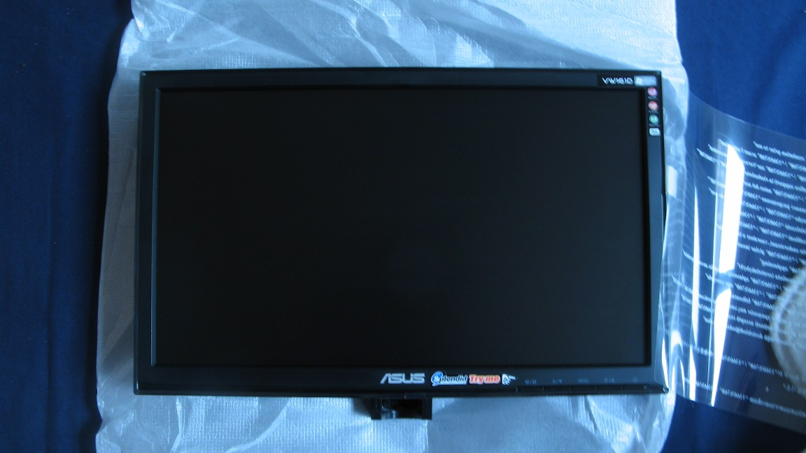](./assets/vw161-step02.jpg)

**Step 2**: Remove the protection screen for more ease of manipulation

[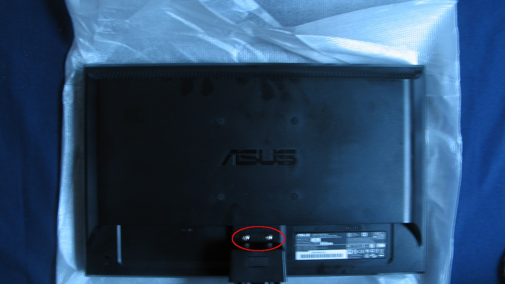](./assets/vw161-step03.jpg)

**Step 3:** Turn the screen around and remove the outlined screws

[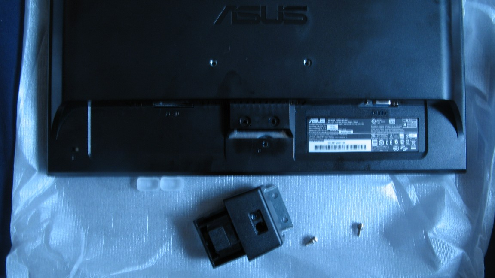](./assets/vw161-step04.jpg)

**Step 4:** Remove the foot block : remember to separate the screws and put them somewhere you can't loose them!

[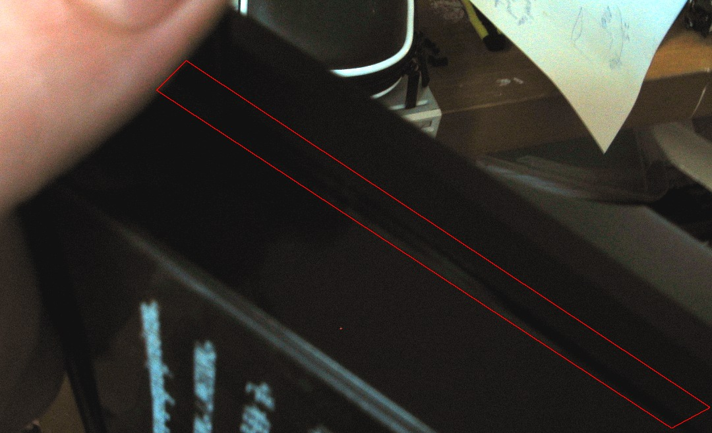](./assets/vw161-step05.jpg)

**Step 5:** BEWARE !! Delicate Step -This is the ONLY step where you might need to force things a bit : but only a bit ! -Slowly pry the side of the box open: for this i used two small flat head screwdrivers:-first you put one in place, pry the box delicately open-then you put the second one a bit further along using the opening made by the first screwdriver , opening a further part with each repetition : this is a slow process, take your time.

[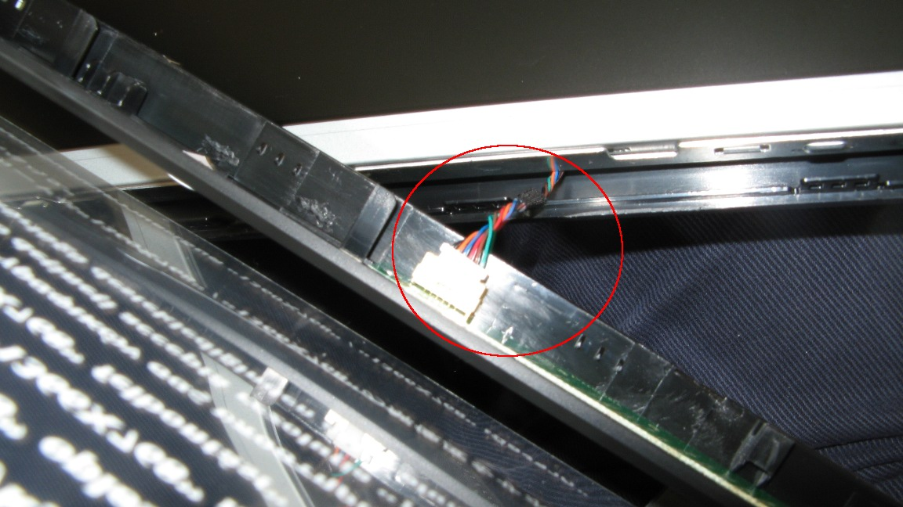](./assets/vw161-step06.jpg)

**Step 6:** Be careful with the underside of the screen in the prying process, since you need to watch out for the front buttons connector : once you have opened the box in this area, simply carefully unplug the connector

[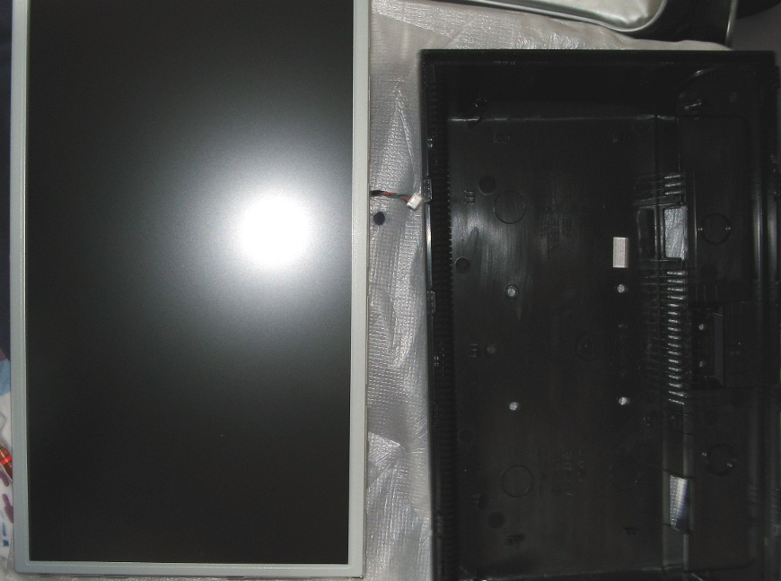](./assets/vw161-step07.jpg)

**Step 7:** Now you can carefully seperate the back of the screen from the front

[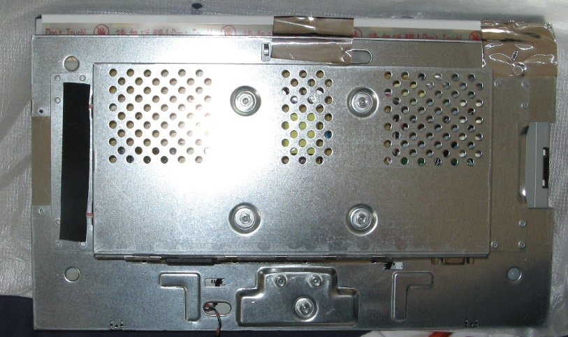](./assets/vw161-step07-back.jpg)

**Step 7-back:** Remove this metalic block from the black cover (shown above)

**Step 8:** Carefully remove all the easilly accessible screws from the side of the metalic box....

[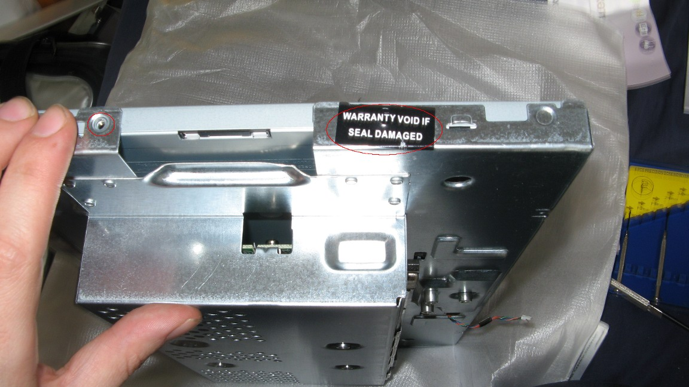](./assets/vw161-step09.jpg)

**Step 9:** ...until you reach this part : the final screw protected by the waranty seal: once you remove this , there is no turning back ! You know what : let's do it anyway !

[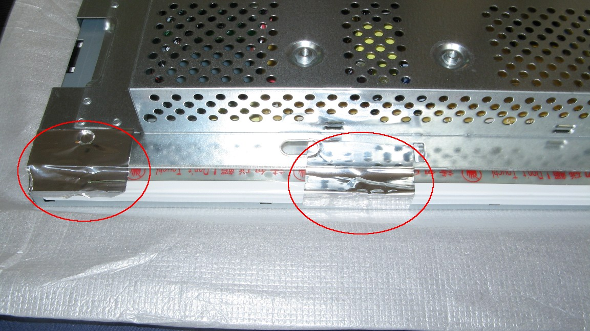](./assets/vw161-step10.jpg)

**Step 10:** Remove the outlined metalic tapes.

**Step 11:** BEWARE !! Delicate Step

\-Very carefully move aside the lcd matrix + backlight from the metal box containing the electronics, DO NOT TRY to seperate the just yet

[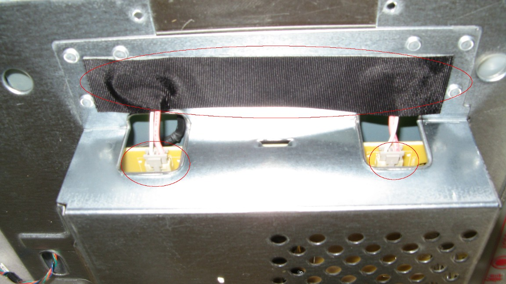](./assets/vw161-step12.jpg)

**Step 12:**

Remove the tape at the back of the metal box and unplug the two backlight connectors

[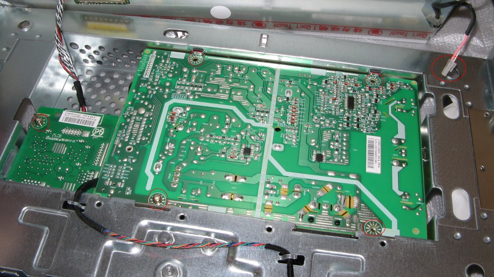](./assets/vw161-step13.jpg)

**Step 13:** BEWARE !! Delicate Step

\--Remove all the screws from the the two boards (power and vga controler) -Move the previously unplugged backlight connectors out of the way -DO NOT try to remove the two boards just yet!

[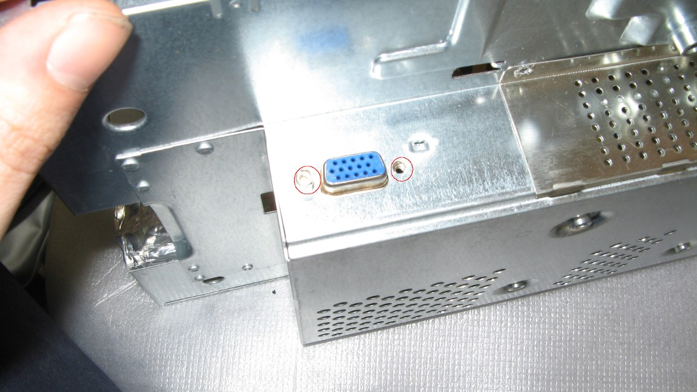](./assets/vw161-step14.jpg)

**Step 14:** -Remove the screws of the vga connector (on the outside of the box)

[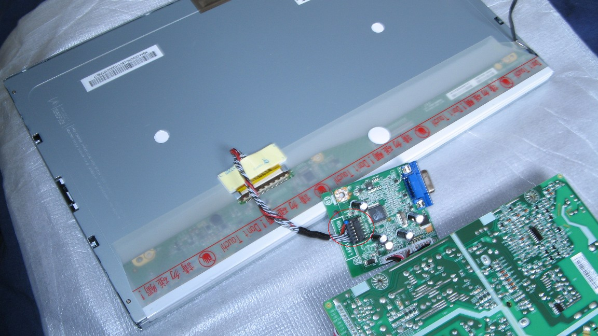](./assets/vw161-step15.jpg)

**Step 15:** BEWARE !! Delicate Step

\-NOW you can remove the controllers from the metalic box : do NOT try to force anything, if all the screws and all the connectors have been removed/unpluged correctly the controlers should be easy to remove -Put them both on a protective surface -Carefully unplug the connector that goes from the lcd to the vga controler

[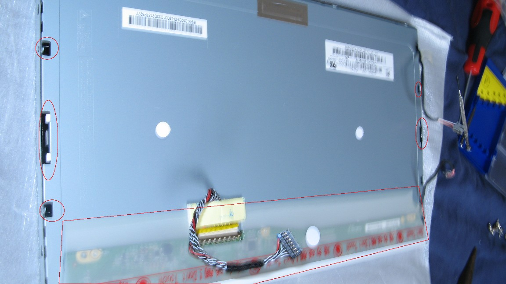](./assets/vw161-step16.jpg)

**Step 16: Almost there !** BEWARE !! VERY Delicate Step -Remove the outlined tape very slowly and carefully, as it protects the most fragile connectors -Remove the yellow sticky element from the back of the metal plate -Pry the metal back away from the LCD matrix, using the outlined elements on the side (sorry haven't taken a close up, but with a little observation and careful manipulation it is very easy to do, just be slow and steady , and pry all the elements open before you attempts to remove the metal plate) -Once the two steps above are done, you can very carefully remove the metal plate from the back of the screen : watch out for the connectors, particularly the flexible one at the bottom of the screen as it is the most fragile element in the screen !!

[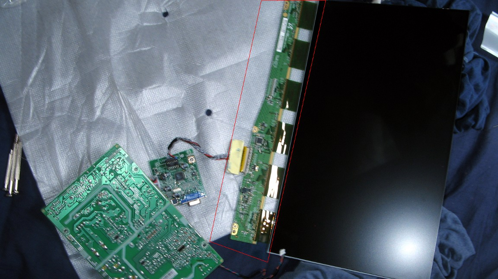](./assets/vw161-step17.jpg)

**Step 17:**

Normally you should be all done now and find yourself with the different elements pictured above, but here are a few more tips:

\-be very carefull when moving the lcd matrix with the ribbon controler underneath it : i generally keep this area covered/ protected -for ease of manipulation , you can unplug the connectors linking these elements together (reduces the risk of ripping cables/ connectors appart accidentally) -try to avoid touching the surface of the lcd matrix, try to move it by holding it using the sides of the screen
