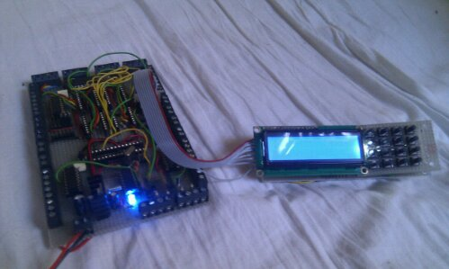
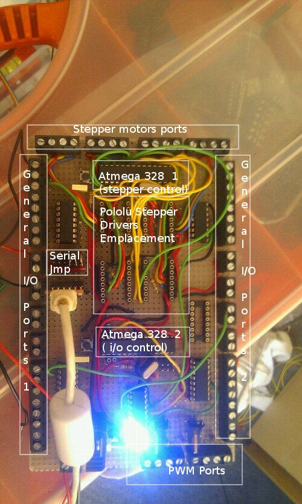
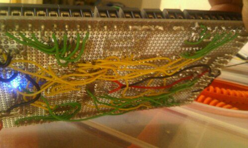
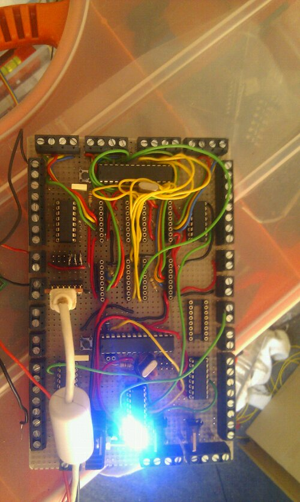
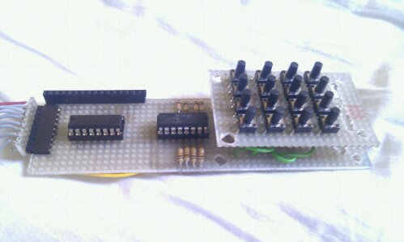

# Building a Repstrap(7) : final electronics/motherboard 

Since i was satisfied with the way the control of the repstrap was working with the temporary electronics setup (on protoboards), i started work on the permanent solution, using standalone AtMega328 (the chip powering the more recent version of Arduino boards) and a lot of electronics equipment i already had. Here is the general overview of the requirements and  what i came up with.

## Requirements:

- **versatile** : needs to handle not only the standard reprap electronic elements (stepper control, opto end stops, extruder and build platform heating and temperature control etc), but also have spare i/o ports for the upcoming 3d laser scanning elements and more
- support the Pololu stepper drivers
- make the machine as **standalone** as possible : this meant a **frontal control panel with lcd display**, and **sd card reader**
- as **cheap** as i could (using equipment i already had or that was easy , and cheap to obtain)

## The result:

1. since a single AtMega328 , even with port extensions would have been pushing things a bit on the speed side (as the stepper drivers require very fast operation , in the microsecond range for example) i decided to use two chips , communicating via  I2c
2. one AtMega controls the steppers exclusively, while the other "master" chip is in charge of all the rest (no problem since all other tasks are a lot less time critical)
3. The master chip is connected to:

- - a **74hc4094** shift register to control a group of **4051** muxers/demuxer for a total of **32 additional i/o ports (up to 64 available)**
    - a second, chained 4094 shift register controls the front 2X16 LCD
    - an addtitional 4051 that checks for the states of a 4X4 button matrix
    - 3 **TIp120** transistors to control the extuder head and heated build platform heaters
    - the completely diy **SD card reader** (using the **SPI** ports)

The end result :

Yes, it is quite complex,  and requires a custom firmware (currently being coded), but for now the results are encouraging , and its very cheap at around **30/40 euros** (**not** including the stepper drivers of course)!

For reference : here is what the protoboard version looked like : VERY MESSY!

I will post the detailed schematics and additional information, as well as the firmware as soon as all this is finished and tested.

And some additional pictures:

