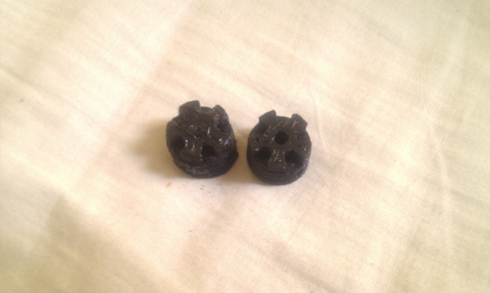
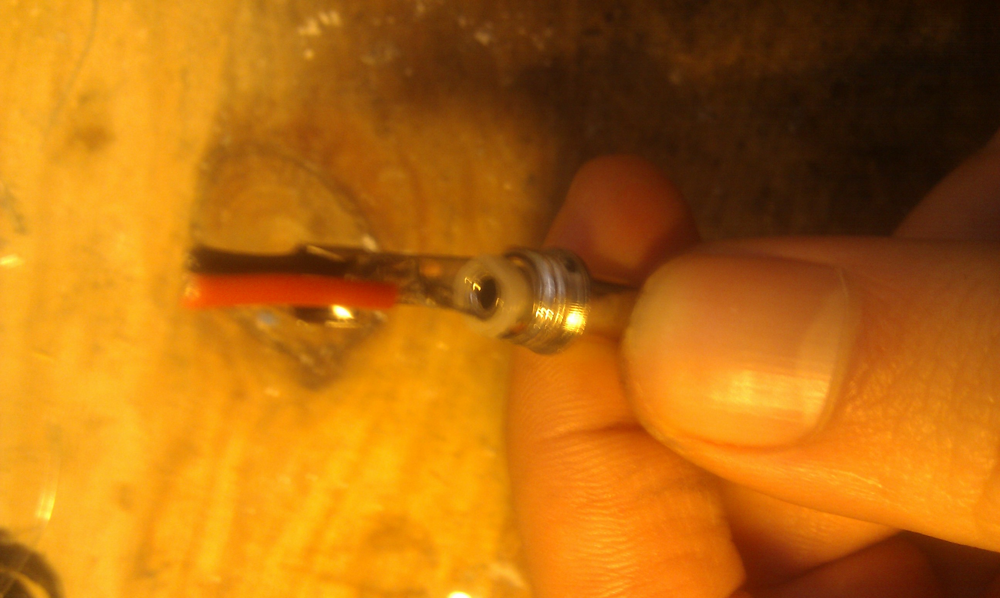
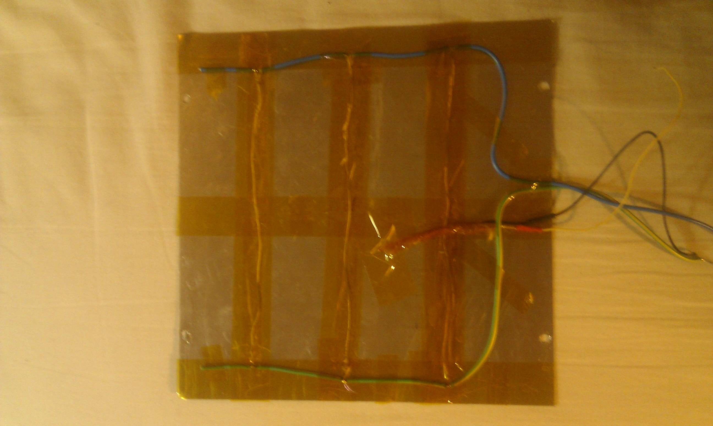
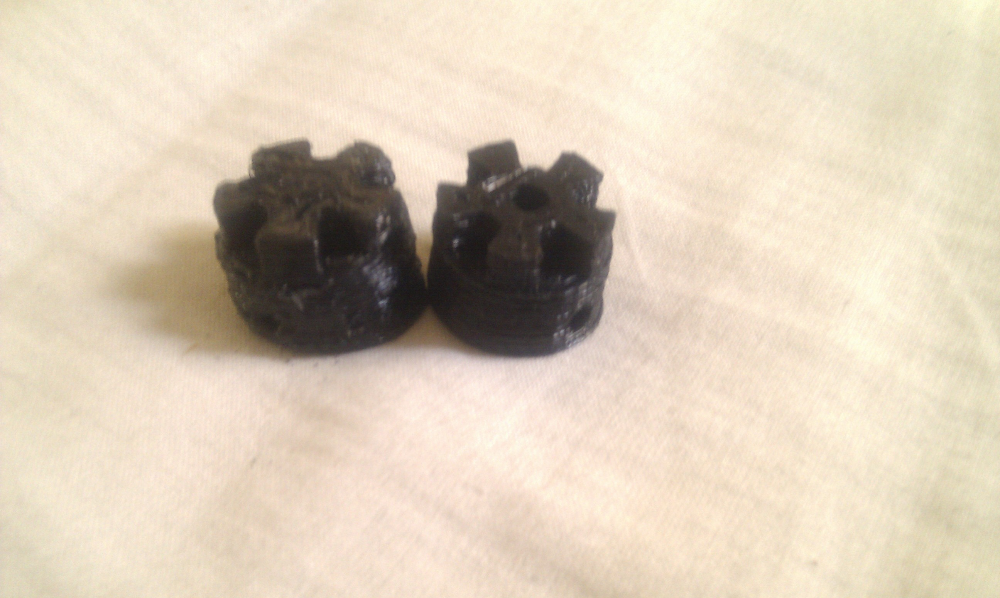
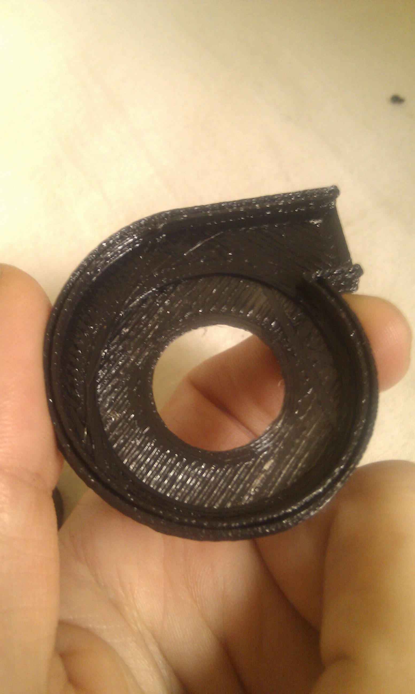
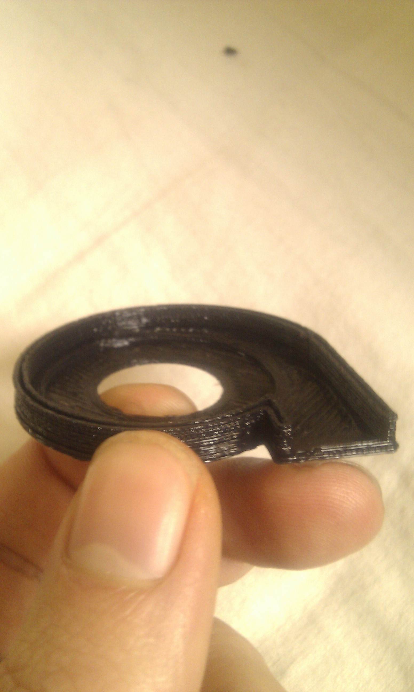

# Doboz repstrap: increasing build quality and reliability 

After a series of semi catastrophic breakdowns (fried heated bed controller and polulu driver etc), aswell as less than perfect reliability (almost half of my print attempts failed one way or the other) and generally not so good print quality , i set to hunt down all the failure sources one by one !

\*\*\*_Nov 29 2010 01 pm : sorry about the pictures not showing up , there was a slight glitch while updating certain wordpress elements_\*\*\*

Here is the breakdown of all problems and how they got solved:

- The **Tip120** transistor controlling the **heated bed power supply** finally fried:
    - which is no surprise, as i completely **miscalculated** the power consumption (TIP 120s are rated at **5 A max** and i was using ...**9 A** !!), i will post a detailed article on the heated bed design and power consumption calculations later on. So i replaced it with a **TIP142, rated at 10 A**, and voila ! heated bed working again, and a lot less electrical glitches.
- There were a TON of strange glitches, weird variations and serial connection cut-offs:
    - Uppon further analysis this came from at least 4 different problems on the machine :
        - The **heated bed** controller issue mentionned above
        - The **power connector** linking the repstrap to the PC's psu (machine side) , was very "touchy" , a slight movement and power would be cut off , and it kept getting worse.. So i opened the connector to find ...it had **melted** on the inside ! This is what i get from pushing 150w through filmsy cables and cheap , bad quality connectors...
        - It turned out that **both** sides of the power cables were firmsy, so i also swapped out the molex connector (PC side) with a better quality version aswell
        - The cabling, both of the heated bed and the machine's power supply was of a too small diameter aswell , and led to overheating, so all of them were swapped out(upgraded version)

All these improvements, changes and adjustements, plus the fact that i kept fine tuning the skeeinforge settings , led to this :

left: before the changes / right : after

- Also, even if i don't mention it often, i am still working on hydroponics projects , and i recently stumbled upon this fantastic **printed pump** by Maddox : [http://www.madox.net/blog/2010/11/16/miniature-3d-printed-pump-using-up-pp3dp-printer/](http://www.madox.net/blog/2010/11/16/miniature-3d-printed-pump-using-up-pp3dp-printer/) and its variation by Skimbal using a cd rom motor: [http://www.thingiverse.com/thing:4881](http://www.thingiverse.com/thing:4881)
    - So i set out to print one to test the new build quality:

 

Quite satisfying overall ! Next up : speeding up  the machine!
