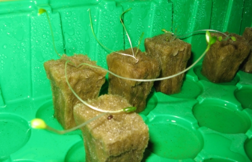
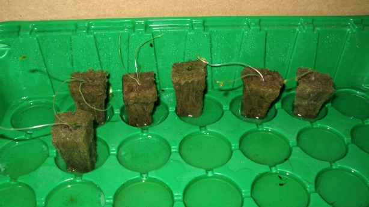
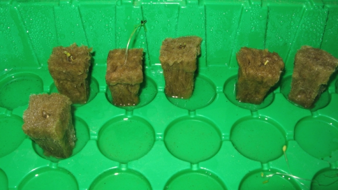

# First growth tests : week 2 ! 

All the plants continue to grow , and a lot better than expected! (mostly if compared to the catastrophic soil test result i made a few months ago).

Besides a "lettuce cutting" accident (just after the first week), for now i have a close to 100% rate of germination.

So we have:

- in the back row (from close up to distant)
    - Parlsey
    - Chives
    - Mentha
    - And two rockwool cubes with lettuce
- in the front row :
    - Lettuce

The Parlsey took its time, but is now the most developped : besides a few health stems and primary leaves, it is the only one so far with roots hanging out of the rockwool cube.

A small comparaison:  this was at day 11:

