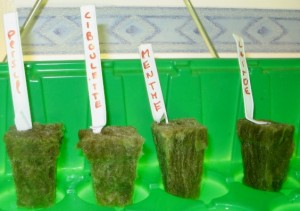
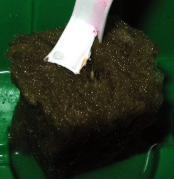

# First growth tests : Week 1 ! 

## 

## First observations:

- Lettuce is the fastest growing of all the seeds i tried for now
- In Less than two days you usually already have a 1cm stalk coming out of the rock wool cube

## Details:

### Letuce

- This is the lettuce sprout visible after just one day:

- After 2 days:

- After 3 days:

- After four days:

