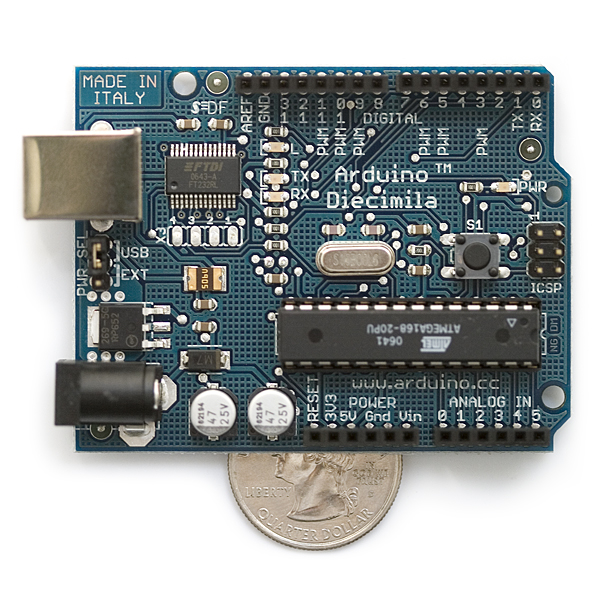

# Homemade Hydroponics-HydroDuino(1) Automation with Arduino 

To go one step further, i decided to try and automate at least part of my hydroponic system, with the help of an Arduino board and a few other things..

### Aims

- Low Cost (well , as much as possible)
- Reliable (I am not home much, and my flat is small, oh and i am quite paranoid about security as well)
- Low Power (this ties in with #1 and #2) : i really am not confident enough in my skills to do precision work and tinkering with 220v machines, so this was a necessity, plus, less power->less stress when the electricity bill arrives)
- Adjustable

### Solutions

- For the electronics part, i went with an Arduino, which is an absolutely fabulous open source hardware : for more info check out their site  [http://www.arduino.cc/](http://www.arduino.cc/) I ordered a starter kit from adafruit.com (which was very good save for the absolutely outrageous french taxes that got added to it on arrival)
- I bought a few 6-12 V cheap water pumps on ebay (about 8 $) : to my surprise these actually delivered more punch than a 240l/h 220V pump
- A few additional electronics components :
    - Tip120 Transistors (beware though, check out the actual amperage of your pumps first! on my first 12V test , the tip120 actually started to overheat and emit smoke!)
    - A few diodes
    - Resitors, leds etc

### How it went:

- To my surprise,  when i first tried the pump on a molex 5v supply, it alreay was powerfull enough to pump the water up by 40cm into 4 of the containters
- If you want to use these pumps at full power (12v) CHECK the actual resistance /amperage first ! Otherwise you might fry your tip120 transistor (i almost did, the smoking was a good tip though :)

Stay Tuned for more!
