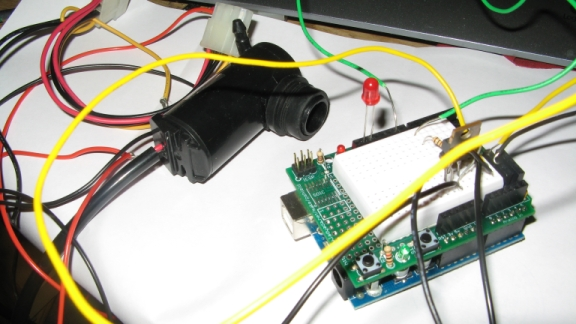

# HydroDuino Pump Control Problems 

The first tests for the timing of my arduino powered ebb and flow system did not really go as well as planned unfortunatly:

- i am having HUGE power fluctuations in the pump, so each and every time i setup a precise timing, i get different fill speeds, wich pretty much defeats the whole "precise timing for a precise filling".

- - in a lot of cases the motor starts of veeery slowly, and the speedup rate to an acceptable level always varies
    - sometimes about halfway through the timing interval (set at 180 seconds for now), i will get a sudden decrease in power : my guess is this is tied to the tip120 transistor, and the lack of sufficient differencial :  i managed to reduce this problem somewhat by exchanging the 1k transistor that goes to the base from the Arduino digital pin with a lower rated resistor

- these problems are unlikely to come directly from the pump as i did not have such fluctuation when running it directly on the power supply

- i am also aware that using a cheap 8$ pump which eats up 2.2A at 5v (twice what was indicated on the seller's site) is also begging for problems

- I am not really good at electronics, but from what i gathered, i might need to add a few capacitors to smooth out the current and reduce the spikes.... more info [here](http://www.tigoe.net/pcomp/code/category/Picbasic%20Pro/62)
