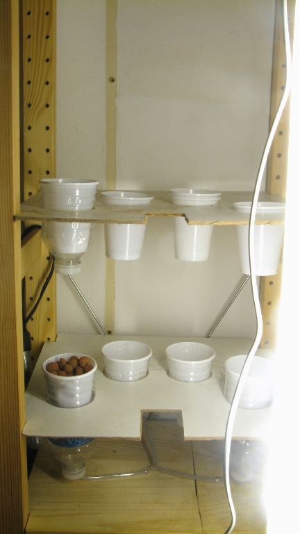
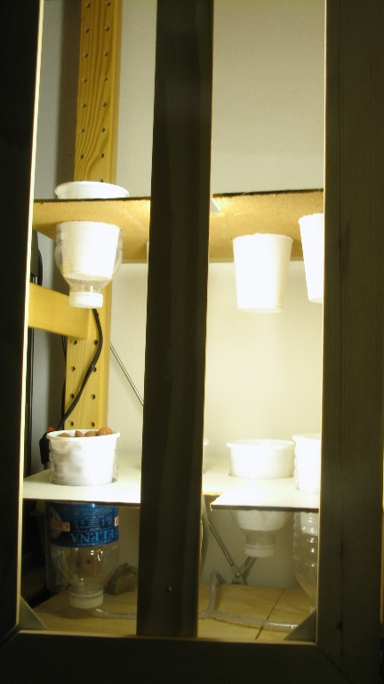
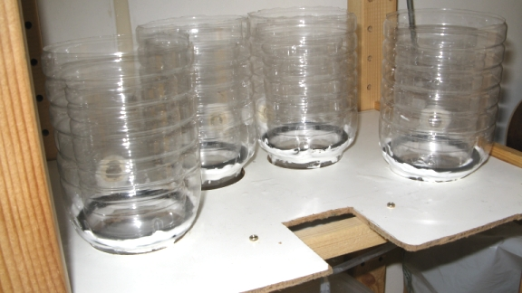

# Homemade Hydroponics(1) Ebb & Flow Setup 

### **Introduction:**

This is the first type of hydroponics system i built: in it's first form , probably the easiest and cheapest to build.

I originally based it on [this](http://www.instructables.com/id/Expandable_Hydroponics_System_from_Junk_Flood_an/ "Expandable Hydroponics System from Junk ") and [this](http://www.instructables.com/id/Modular_Windowsill_Air_Powered_Hydroponics_Herb_Ga/) (very nice instructables).

### **Parts:**

\-One or more plastic bottles

\-Saw to cut out the bottom of bigger plastic bottle to fit the small ones in(i used a 60 mm one, standard plastic cups fit right in) (5euros for a set of 6 different diameters) (this may also come in handy to cut out the board where you will place these bottles)

\-Air pump : standard aquarium air pump (around 20-30 euros for a Rena pump) (for the first version)

or

\-Water pump (any sufficiently powerful water pump)

\-A few meters of 1/4" silicon tubing (at any aquarium shop, or better, at gardening shops, since they are usually WAY cheaper)

\-Basic plastic cups : you will need to drill/melt a few holes and cut the sides a bit to let the water and the roots through

**_The rest of the list is purely dependent on your specific needs:_**

\-Depending on whether you will be  doing your culture indoor or outdoors you might need some lamps ( i just bought some relatively cheap (19 euros) 13W/50 cm fluorescent tubes, not sure on how fine that will go , but well)

\-I also had to build a door and some walls to provide some protection of my tiny flat from water projections/ isolate the grow box a bit

\-Some sort of sheeting /aluminum foil to protect the roots from the light

\-A kind of stand/structure to hold your home made watering system in place (i found (on the street!) a 1/1m 5mm thick plank which was just perfect for that

### **The result**:

So i have divided my available shelving place (30\*35 \*180) into two compartments :

\-upper shelving : 30\*35\*85

\-lower shelving : see part two

### Problems:

I went through a bit of trial and error, and tried to make a maximum use of what i had in hand, so it is far from perfect: ( i actually bought WAY to much material compared to what i actually needed in the end)

\-The air pump solution is the cheapest to build, but a bit hard to manage precicely

\-I decided to add the overflow protection system later, which came with its own handful of problems

\-This really is my favorite system as far as flexibility goes
