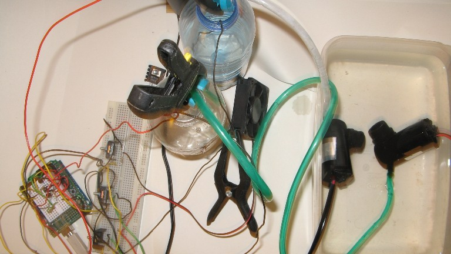

# Hydroduino Pump control solved + project update 

It has been a while , but i have finally gotten around to work on the pump control problems i  previously had  and here is the result.

## What has been done /solved:

- It turns out the pumps really run way better on 12v, control is still being done via Tip120s (with heatsink this time) , although they do not really get as warm as i previously experienced.

- For now it is running in semi autonomous mode : you can switch the pumps on/off via a small Python program i wrote (also used for monitoring), but they also shut of automatically once the desired level is reached (electrodes you can see going into the bottles)

- There is also a small 5v fan which is only controlled manually for now , but which will be automated as well (on/off switching based on temperature)

## The (near) future:

- Next step will be led lighting control , which will be quite a bit trickier , since it will need manage a large number of leds,  with different channels (red/blue), and will need to be modular aswell (thinking of smaller sized led arrays that can be linked together )

- The python and arduino programs are pretty messy for now, so a lot of work will go into that area as well

- Remote control, and dataloging is also planned /partially implemented

Here are a few videos of the (messy) prototype: 

[Hydroduino prototype : working pump control vid 2](http://vimeo.com/7422292) from [mark "ckaos"](http://vimeo.com/user1581901) on [Vimeo](http://vimeo.com).