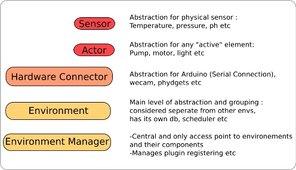

# HydroDuino...reborn! 

This is when i realize i may be working on too many projects... A few months (ok a lot of months) ago i started rewriting from scratch and greatly expanded the HydroDuino project's software side, and had a working, if basic version,but completely lacking in modularity (basically it was a completely monolithic, tightly coupled app)  and hard to maintain and expand.

So i started an almost complete rewrite based on what was working and what wasn't, aiming for a **highly modular**, yet **lightweight** system, and now things are progressing at full speed , so it was time for a "public anouncement" of the state of the project, since i still get quite a lot of emails of people wanting to use it/participate.

## Foreword:

This article is meant to represent the current state of the project, and since its mean to be usable (hopefully) usable, and community driven, i would really apreciate **_any feedback_** ! If you think the whole thing, ore certain aspects of it are absurd, or unusable, or badly designed , or anything, don't hesitate to contact me or leave a comment!

When the first version is released it will be available here : [http://code.google.com/p/hydroduino/](http://code.google.com/p/hydroduino/)

## Currently implemented features

### **It is now 3 semi seperate projects :**

- The **core of the system** , the "server" side backend is where most of the "magic" happens, and which provides all the main functionallity, the handling of sensors , hardware etc
- The basic web based user interface frontend: in ajax with a python webserver backend that communicates with the core's wsgi api
- An android based user interface frontend (still in the very early stages)

### General structure:

For a better understanding here is what the different things mean:

(Hardware connector is the same here as hardware node, for more explanation , see below in the "Where it is headed" part)

- each **environment** is kept as separate as possible to avoid the problems of one of them affecting all of them : so each environment has its own **sqllite db** , its own scheduler(s), data access system etc
- currently all the **sensors** are within their parent "**HardwareNode**" object and have a rather strong coupling with it : for example for an Arduino and its sensors, there is a "ArduinoNode" which is a child class of the general node class, that manages the connection to the arduino via serial  etc
- the arduino side software is now a library + main code that alows the system (and you) to reconfigure the different ports, set triggers and automation etc

### Plugin based system:

There are two main types of "plugins"

##### Hardware Types:

- out of the box , Hydroduino will come with an "Arduino Node" : all you need to just plug in an arduino , configure the software, and have it running in just a few minutes
- anyone can easilly add support for different type of hardware : ie Phydgets, Webcams etc with very little work , then just drag and drop the new code into the hardware plugins' directory and then be able to use this new hardware through the generic interface

##### Converters:

if , like many people , you have been tinkering around with Arduinos, electronics , sensors etc, you know that it is not always easy to read through a specific sensor's technical sheet to be able to _convert_ **raw** analog/digital values _**into**_ **usable data.** Well the "converter" type plugins are there to make life easier : they will be a user generated, shared library of conversion functions, so that once someone has figured out a good **conversion formula** for a specific type of sensor, anybody else can just use that code **automatically**!  When you add a new sensor , just set its model name (the name of the actual physical sensor) , and if that converter exists, it will automatically be used when retrieving the data.

### Automation:

- Schedules: you can set when you want to retrieve the information from a specific sensor, or when and how often you want a pump/motor/lamp whatever to run
- Triggers: you don't want the pump watering your plants to keep on working when there's already too much water ? Just set a trigger on a water probe/level sensor to have it shut down automatically when certain conditions are met

**A small note about this**: for now automation runs on the python _**host**_ side, but i plan to have it be settable : if you want some time critical triggers etc, they will also be settable directly on the Arduino side of things , so there is no delay.

### Lightweight:

- Even if it does complicate things a bit, the external dependencies of the python code are kept to a strict minimum, and i generally avoid big "framework" type dependencies (ie, no Django , etc required)
- Small memory usage: the tests i have done for now of what an average user might use/have, generally come with a l**_ess than 4 Mb_** memory consumption, although this is not set in stone, as the software is still not as feature rich as i would like, and in a pre-alpha stage.

## Where it is headed

While a lot of these features are currently implemented, and the general structure and how it works is much cleaner than before , it is far from finished, and in constant evolution (but getting there). These are a few of the problems i am facing:

#### Lots of work left :

- While the core of the system is functional , a lot of parts still are not !
- a great deal of functions are not implemented yet
- each major change in the basic systems required quite a lot of rewriting (since some of them are not set in stone 100% yet)
- there currently is no UI to work with , since the underlying server's structure has been completely altered
- the project is way bigger than it was

#### To depend or not to depend:

Since i want to keep things lightweight , i am always a bit reluctant to add additional dependencies on other python packages/libraries/frameworks, but always reinventing the wheel is not a viable option either! This applies to :

- **ORM** : (object relationship mapping): i have given small test runs off different Python Orm ([Autumn](http://autumn-orm.org/), [Storm](https://storm.canonical.com/) ,[SqlAlchemy](http://www.sqlalchemy.org/) etc) but haven't found something lightweight enough , and that doesn't require to change class hierarchies (i especially like SQlAlchemy's approach though) (having to change the base class of an object is a big no no , because of the too tight coupling, but i ain't 100% sure yet) but i will write more on this in another article
- **Wsgi /web server**: this is one area where python definitely offers **_too much_** choice ! In the previous version, i was using **[Bottle](http://bottle.paws.de/docs/dev/index.html)** a very nice "micro framework" , that is only **_one_** file ! But i am still looking around to find the right thing, and in the current version i just have a minimal , pure wsgi code without external framework , for the "**_WSGI interface_**"  part (see the different drawings ) that sort of "publishes" the different public functions of the Environment manager to make them accessible via http

#### General structure changes:

While coding and testing the different aspects of the system i realized, that, while being a nice "functionality bag" /black box to work with,  the **HardwareNode** structures are far from perfect:

- it makes sense for the sensors of an Arduino to be "inside" a software abstraction of it (the _**ArduinoNode**_) : the list of sensors is actually stored inside of the the ArduinoNode data structure , and there are methods to access the sensors by type, by id , etc  .
- but it does not make sense for a webcam for example : what would the node be ?  what would the sensor be ? In this cas there is actually not really any difference between the node and sensor, and its just confusing

So i might alter the general structure somewhat :

- **Nodes** would become **Connectors:** it makes sense to think of the Arduino itself, or a webcam's usb interface as a means of communication between the sensor and the host : it is much more generic and understandable
- Connectors would not _Contain_ Sensors anymore, connectors would simply set themselves up/connect to the hardware , to _Provide_ an access for sensors, would would just have a reference to the connector they use.
- This would also reduce the effect of having to use the Node as proxy aswell as a connector : currently , to communicate with a specific sensor , you have to go through : the environment->the node manager->the node ....

## Ye old version:

As a reminder, and since i never posted it here :this is what the project's web based user interface looked like before the "reboot":

