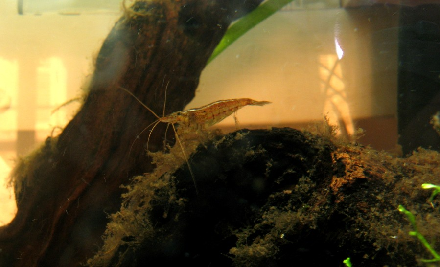
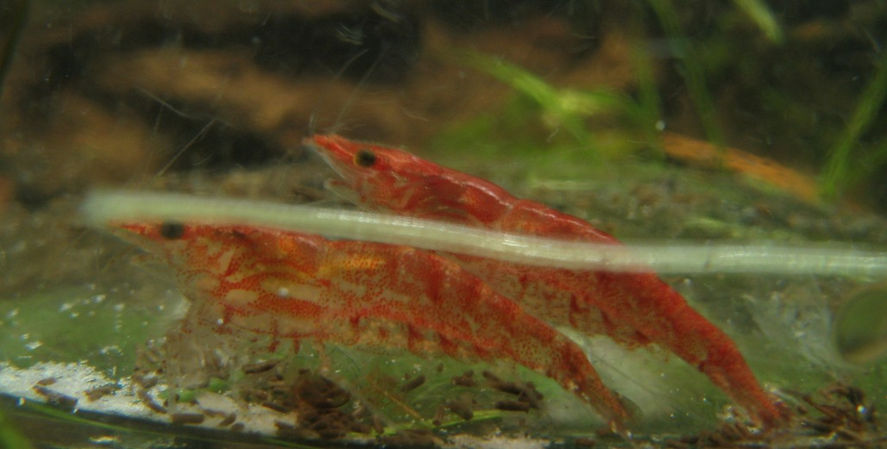
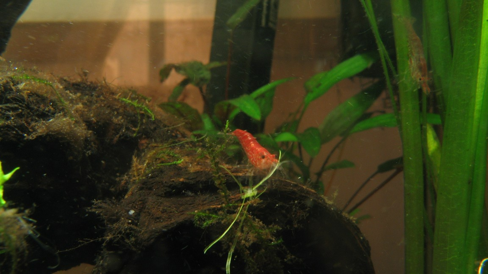
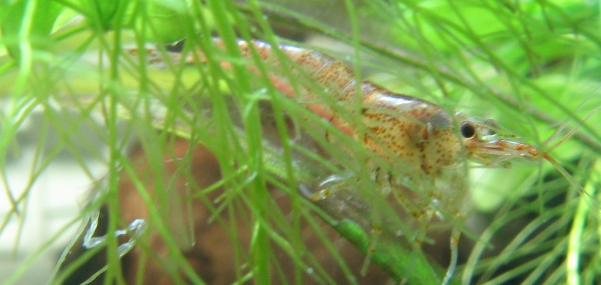

# Just Shrimpin' 

A week ago, i bought a group of around 24 NeoCaridina Heteropoda Sp-Red softwater shrimps (commonly called "red cherry" ), since i had a 30 liter tank , with nothing but a few plants and 3 older shrimps ( identified as "basic" Neocardinas).

Some pictures, taking during the acclimatisation phase (particularly important with shrimps, to reduce the risk of osmotic and temperature shock) , and just after their release into the tank.

A "basic heteropoda" in one rare moment of calmness ( shrimps rarely strike a pose):

Some  information :

- As the tank has been  very stable for almost a year (even though i must confess i left it without care for a few month), and the new shrimps seem to be adapting nicely (not a single death, healthy appetite, regular shedding of exoskeletton on the younger specimens), i hope to have them reproduce soon.
- These are also part of my larger project of hydroponics/aquaponics (basically the re-use of dirty water from fish and shrimp tanks to use as nutrient source for a hydroponic garden)
- More information on the "red cherry" shrimps [here](http://en.wikipedia.org/wiki/Cherry_shrimp "Wikipedia article on red cherry shrimps")

And a small video : filmed about 2 hours after the introduction of the new population:

[Neocaridina Heteropoda and "Red Cherry" variety swimming](http://vimeo.com/5140957) from [mark "ckaos"](http://vimeo.com/user1581901) on [Vimeo](http://vimeo.com).

Normally, these Heteropodas are amongst the easiest to keep so we shall see!
