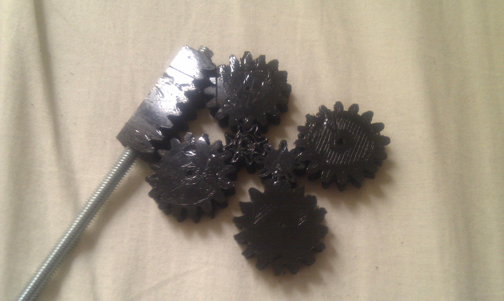
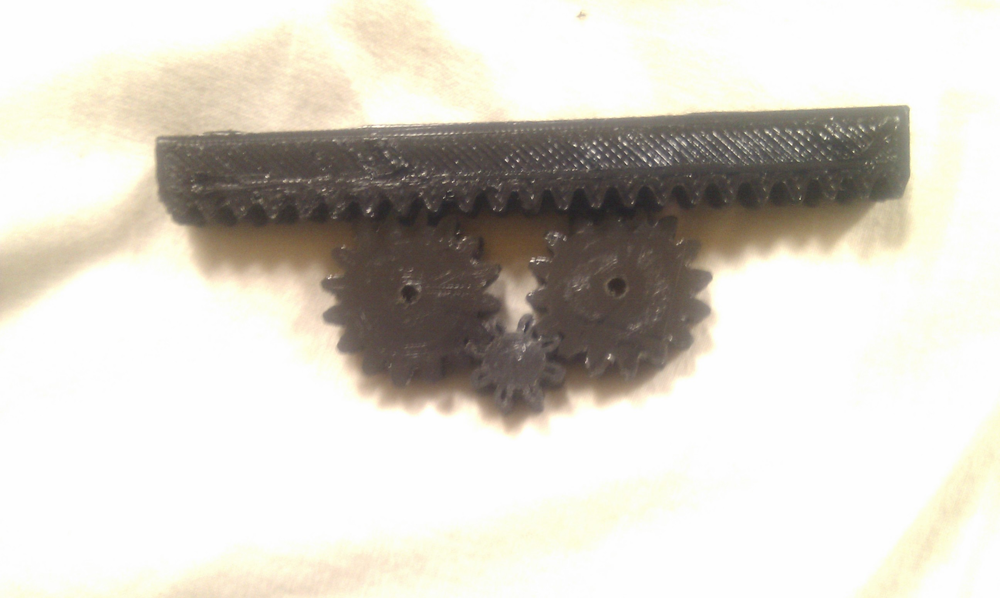
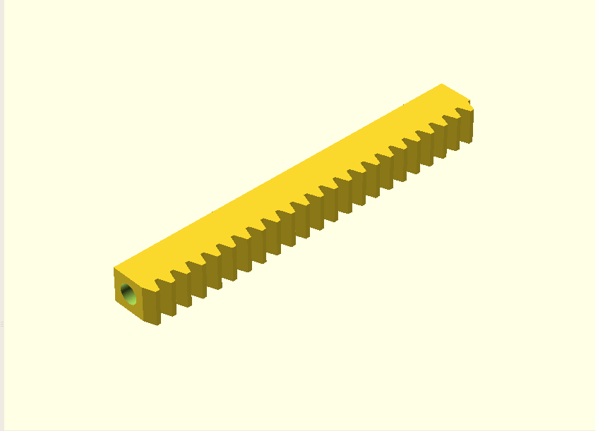
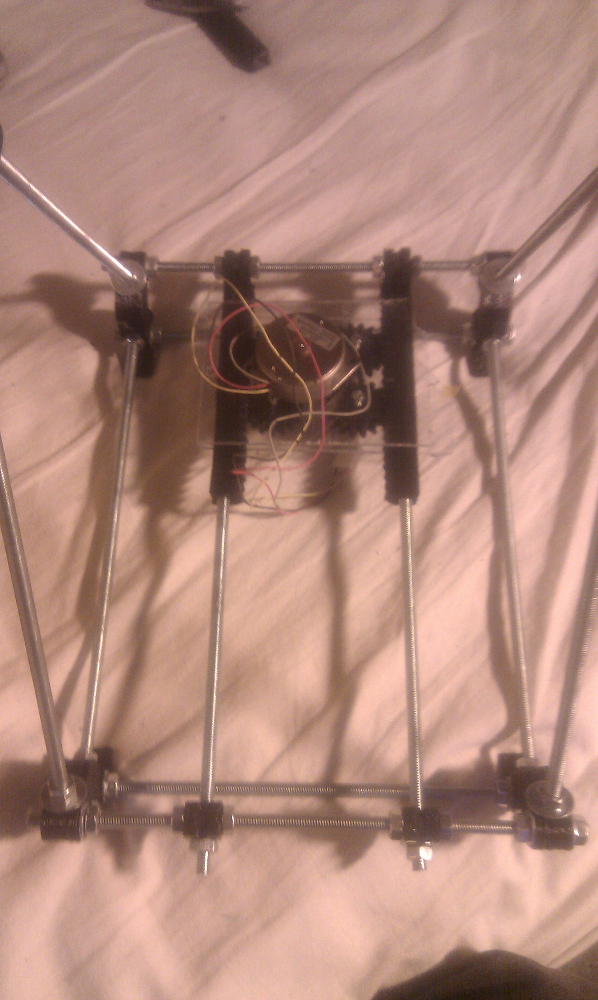

# Modular, parametric printable rack (for rack&pinion) for Reprap  

Anyone who has worked on/built a reprap  knows that sometimes, it is hard to find its '**_vitamins_**' (not printable elements) for certain parts: one particularly hard /expensive piece are the _belts_ and people have been trying to find ways to replace those with fully 3d printable parts: here is my contribution in the form of an **_[OpenScad](http://www.openscad.org/)_** script to generate modular and parametric racks .

## Credit where credit is due :

Let me begin by saying that i would not have been able to do this  without  the fantastic work by Forrest Higgs  as explained in his articles:

- [http://technocraticanarchist.blogspot.com/2010/01/high-speed-alternative-to-belts.html](http://technocraticanarchist.blogspot.com/2010/01/high-speed-alternative-to-belts.html)
- [http://blog.reprap.org/2010/01/high-speed-alternative-to-belts.html](http://blog.reprap.org/2010/01/high-speed-alternative-to-belts.html)
- [http://technocraticanarchist.blogspot.com/2010\_10\_01\_archive.html](http://technocraticanarchist.blogspot.com/2010_10_01_archive.html)

and the equaly awesome work done  by \_Peter:

- [http://www.thingiverse.com/thing:3554](http://www.thingiverse.com/thing:3554)

and  [this](http://reprap.org/wiki/Gears:Simultaneous_Meshing_with_Rack) article in  Reprap wiki as well as the Octave script for rack and pinion generation found here [http://forums.reprap.org/read.php?1,51452,52099#msg-52099](http://forums.reprap.org/read.php?1,51452,52099#msg-52099)

## The whys and hows:

### Why:

- When i mentioned the _**unavailability of belts**_ i was not joking:  it was one of the reasons i went with the "**_threaded rod" approach_** for the Doboz Repstrap , unfortunately, that also means that my machine was **way** slower than it could have been, hence the horribly long print times.
- The availability of such printable alternates is **_absolutely crucial_** to the spread of reprap style printers: if you can't event get your hands on the most essential mechanical parts , and you can't even ask anyone in the world to print it, it is a big no no
- Also, i must confess,i find working, 3d printed mechanical parts plain cool, and a good showcase of the abilities of Repraps/Repstraps :)

### How:

- **Modularity:** was essential since there are quite a few variations of repraps, and having the length of the rack be variable meant easier experimentation , and also made sure that it can be assembled with other elements to build more lengthy  railings . Also , withouth modularity it would be impossible to print, as the typical length of such racks is **more** than the maximum printable length on most machines: in my case i could have the necessary size for the y axis by printing two 13cm rack/rails

Here is a small (5cm) rack module: 

And the bigger one (13 cm):

- **Parametric**_:_ there is a trend in making more and more Reprap parts parametric (ie: you can change the design of an object to suit your needs, just by altering a few parameters) and for a reason : it makes it more adaptable to different cases, design variation, machine sizes etc

- One of my additional constraints was that it should easily integrate with the current structure/general assembly of a "Mendel" Reprap: hence the decision to have these racks be mountable on threaded rods, and attachable to the frame in the same way the smooth rods currently are.

In this screecap you can clearly see the central hole , for mounting 

And in  the following picture you can see the printed version in place on a Huxley:

- But wait, there's **more** ! While not immediately clear, the rack is also meant to act as a rail and replace the smooth rods as "rolling surface" based on a similar approach to this one :[http://www.thingiverse.com/thing:3554](http://www.thingiverse.com/thing:3554)

### Script download , explanation and future work:

- For the gears themselves i used this very nice script: [http://www.thingiverse.com/thing:3575](http://www.thingiverse.com/thing:3575)
- It is actually my first open scad script,  and its still in the very early stages , so sorry if it is not quite clean yet!
- You can find the instructions in the Openscad files available below.
- Things i planned:
    - i will be adding a version of "herringbone" racks .
    - integration of script to generate the gears.
    - ability to generate x&y platforms , with all sub elements (rack, pinion,platform structure,different motor mounts ).
    - general cleanup.
- In the meantime you can find the script here : [http://www.thingiverse.com/thing:6011](http://www.thingiverse.com/thing:6011)

### The result in action:

And here is the result in action on my wip "Huxley" Reprap: Please keep in mind, nothing in this is assembled permanently or solidly, it was just a quick test (using an old Stepper motor from a printer and a Pollolu driver):

