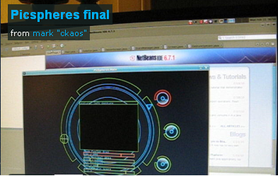

# Picspheres- a gesture based interaction photogallery 

 Hello everyone,

This is a project that was done for my "man machine interface/ multimedia" course at university, with quite a few additions. Without further ado , here is a small presentation video , more info , source code etc after the break.

[Picspheres final](http://vimeo.com/9629855) from [mark "ckaos"](http://vimeo.com/user1581901) on [Vimeo](http://vimeo.com).

## Information and features:

The aim was to come up with a way to display 100+ photos in a photo-gallery, with original input methods being a bonus, it was written in Processing, with some additional Java elements.

Because of performance issues , i decided not to use openCV , but write my own blob detection/ tracking programming , using [Gstreamer](http://createdigitalmotion.com/2008/09/gsvideo-gstreamer-video-library-for-processing-cure-for-live-video-ills/) for the webcam feed acquisition, as well as a small gesture recognition system based on vector product.

Here are some of the features:

- each picture group is gathered from a different folder and is projected on a 3d sphere: (_**200+ photos**_ in the first gallery) which allows an overview of a lot of pictures at the same time
- **_gesture recognition system_** ,based on the vector product between the last few (8 in this video) strokes drawn by the user and a set of reference gestures stored as arrays of vectors.
- i  initially used  a "brightest" element **_blob tracking_** system but later switched  to a **_motion based_** one , as it is much more reliable under different lighting conditions
- during the development of the project i made big improvements in blob tracking speed ( with 30 pictures, runs at _**30fps on a Asus 1000h**_)
- multiple galleries
- possibility to adjust tracking and gesture parameters from inside the program

## Lessons learned and possible evolutions:

- I learned a great deal with this project, both in the field of image analysis , blobs tracking and gesture recognition, but on the practical side i must confess that spending half a day perfecting the calibration of gesture recognition make me doubt the _**usability**_ of purely gesture based User Interfaces in a work environment (à la "Minority report") , as it seems **_way too tiresome_**, but then again it could just be the problems of my specific implementation of such a system.

- On the other hand, i might one day adapt it to be usable with a system like the "_**Eye writer**_" (quite an amazing project : you can check it out **[here](http://www.eyewriter.org/)**), which seems someone more natural , and less prone to require excessive movements  (my neighbors by now most probably think i'm crazy to continually wave my hands around in front of the screen).
- I confess i love futuristic interfaces (from the Ghost in the Shell anime/manga and the Mass Effect 2 game specifically ), so that might show here :)

## Downloads :

The program was tested on Windows **_Xp_** , Windows **_Seven_** and _**Ubuntu**_ and should normally run even on relatively old machines. If you want to try it out using your own pictures , just copy them into the **_data/testPics_** or **_data/testPics2_** folder:

- You can download it **here** **_(edit some slight adjustment needs to be made before i re-upload it, should be done by tomorrow)_**
- The source code is **here** **_(same as above)_**
- The (small) manual is **[here](http://www.kaosat.net/downloads/picspheres/manual-en.pdf)**
