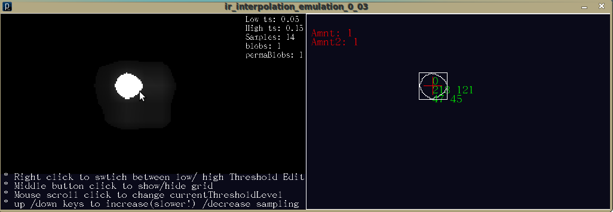

# Ir interpolation emulation + openCV blob detection & tracking (applets) 

- So , i expanded a bit upon yesterday's code to include some basic openCV blob detection (openCV for Processing can be found [here](http://ubaa.net/shared/processing/opencv/) ) and some VERY basic tracking: for a first test it works great, although the weird "jumps" in the blob due to the approximations i use to convert the mouse position will need to be fixed.
- After the jump you will also find a small and basic test applet i did that uses linear interpolation on 2 axis to evaluate more precisely the position of an object/finger. This will probably be used in a form or the other in conjunction with the general bilinear interpolation used in the other program: it only used the intensity of 3 points (think sensors ) to evaluate the possible position of the object.
- This time i don't include the code for these are it is way too dirty for public consumption, but as soon as things are cleaned up, i will post that.

**Applet one**

- Sorry but the applet that uses openCV for tracking seems to crash browsers , so here is a link to it , but in a .rar file instead ( please bare in mind this is a very early test)
- Get it [here](http://www.kaosat.net/applets/ir_interpolation_emulation_0_03/ir_interpolation_emulation_0_03.rar)

**Applet two**

- The applet with simple 3 point linear interpolation for position estimation: point A is in the upper left corner , B on the upper right, and C lower left
- In this case the mouse just changes the simulated ir intensity at point B and C , the position (in blue) and its intensity then get approximated

