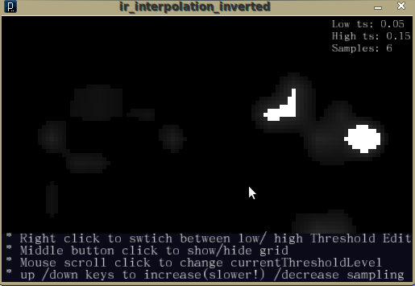

# IR interpolation (Processing applet and code) 

Here is a little program i wrote in Processing to test out some interpolation algorithms with lower/higher threshold value limiting etc.

It is quite rough and incomplete for now , but the main part, the bilinear interpolation between all 4 points in each "cell" of the sensor grid works well.

You can adjust the interpolation precision as well as the lower and higher thresholds.

You can try out the applet and download the source code after the break

Why is there "Emulation" in the title ?

\-simply because i am emulating the touch of a finger with the mouse and the resulting values of ir intensity,  in a quite limited way with interpolation as well: the precision here is not high as it would actually be, and lot of adjustments and modifications need to be made still.

The grid is the estimated size i will need for the 16" asus screen.

**Source code:** [ir\_interpolation\_inverted\_0\_01](http://www.kaosat.net/applets/ir_interpolation_emulation_0_01/ir_interpolation_emulation_0_01.pde) [grid (most important stuff is here)](http://www.kaosat.net/applets/ir_interpolation_emulation_0_01/grid.pde) [keyboard](http://www.kaosat.net/applets/ir_interpolation_emulation_0_01/keyboard.pde) [mouse](http://www.kaosat.net/applets/ir_interpolation_emulation_0_01/mouse.pde)

Code is gpl unless specified otherwise. (feel free to use anything you can salvage:) Main File

PFont font;
Grid testGrid;
MouseMgr mouseMgr;//mouse manager
KeyboardMgr keyboardMgr;//keyboardmanager

void setup()
{
   size(510, 330);
   testGrid=new Grid(10,18,30,0.05,0.15,4);
   testGrid.init();
   testGrid.clear\_grid();

   mouseMgr=new MouseMgr(testGrid,this);
   mouseMgr.init();
   keyboardMgr=new KeyboardMgr(testGrid,this);

   font=loadFont("UMingCN-48.vlw");
   textFont(font,18);
   frameRate(30);
}

void draw()
{
  background(10, 10, 25);
  testGrid.draw();
  textFont(font,18);
  fill(250,250,250);
  text("\* Right click to swtich between low/ high Threshold Edit",5,282);
  text("\* Middle button click to show/hide grid",5,297);
  text("\* Mouse scroll click to change currentThresholdLevel",5,312);
  text("\* up /down keys to increase(slower!) /decrease sampling",5,327);

  fill(255,255,255);
  textFont(font,15);
  text("Low ts: "+testGrid.get\_lowThreshold(),410,15);
  text("High ts: "+testGrid.get\_highThreshold(),410,30);
  text("Samples: "+testGrid.get\_samples(),410,45);

  testGrid.fade\_grid();
}

Grid Class

class Grid
{
  float\[\]\[\] bigSamples;//emulation of sensor grid values

  boolean lowEditModeOn;
  boolean drawGridOn;

  int gridHeight;
  int gridLength;
  int gridCoarsness;//size of each grid "cell"
  float lowThreshold;//theshold below which values get cut to 0
  float highThreshold;//theshold below which values get upped to 1
  int samples;//how much intermediate samples we interpolate within each cell

  public Grid( int gridHeight, int gridLength, int gridCoarsness, float lowThreshold, float highThreshold,int samples)
  {
    this.gridHeight= gridHeight;
    this.gridLength= gridLength;
    this.gridCoarsness= gridCoarsness;
    this.lowThreshold=lowThreshold;
    this.highThreshold=highThreshold;
    this.samples=samples;
  }

  public void init()
  {
    bigSamples=new float\[gridHeight\]\[\];

    for(int i=0;i5)
        {
           bigSamples\[i\]\[j\]=random(0,1); //don't mind this , it's from a previous test
        }
        else
        {
           bigSamples\[i\]\[j\]=0;
        }
      }
    }
  }

  //function for bilinear interpolation
  public float interpolate\_bilinear(PVector interpolated, float upperLeft, float upperRight, float lowerRight, float lowerLeft)
  {
      float result=upperLeft\*(1-interpolated.x)\*(1-interpolated.y);
      result+=upperRight\*interpolated.x\*(1-interpolated.y);
      result+=lowerLeft\*(1-interpolated.x)\*interpolated.y;
      result+=lowerRight\*interpolated.x\*interpolated.y;
      if(resulthighThreshold)
      {
        result=1;
      }

      return result;
  }

  public void draw()
  {

    float spacing=(float)(1/float(samples));
    float x=0;
    float y=0;

    float sX=0;
    float sY=0;

    for(int u=0;u<1)
        {
         lowThreshold+=0.01;
        }
     }
     else
     {
         if(highThreshold+0.01<1)
        {
         highThreshold+=0.01;
        }
     }
  }

  public void decrease\_threshold()
  {
    if(lowEditModeOn)
     {
        if(lowThreshold-0.02>0)
        {
         lowThreshold-=0.01;
        }
      }
      else
      {
        if(highThreshold-0.02>0)
        {
         highThreshold-=0.01;
        }
      }
  }

  public void increase\_samples()
  {
      if((samples+1)<64)
      {
         samples++;
      }
  }

   public void decrease\_samples()
  {
      if(samples-1>0)
      {
         samples--;
      }
  }

  public int get\_samples()
  {
      return samples;
  }

  public void set\_editMode()
  {
     if( lowEditModeOn)
     {
      lowEditModeOn=false;
     }
     else
     {
        lowEditModeOn=true;
     }
  }

  public void set\_drawMode()
  {
     if( drawGridOn)
     {
      drawGridOn=false;
     }
     else
     {
        drawGridOn=true;
     }
  }

  public int get\_gridCoarsness()
  {
     return  gridCoarsness;
  }

  public float\[\]\[\] get\_bigSamples()
  {
    return bigSamples;
  }

  public float get\_lowThreshold()
  {
     return lowThreshold;
  }

   public float get\_highThreshold()
  {
     return highThreshold;
  }

  public void set\_bigSampleValue(int x, int y, float value)
  {
    bigSamples\[y\]\[x\]=value;
  }

  public void clear\_grid()
  {
     for(int i=0;i0)
          {
            bigSamples\[i\]\[j\]-=0.01;
          } 

      }
    }
  }

}
