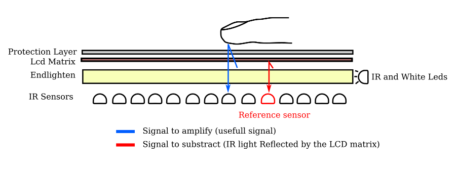

# Projects update : learning from mistakes(2) - Multitouch 

I have not been able to work on my flat-multitouch screen prototype in the last few month but i intend to step it up this year : so here is a short overview of what has been done, and what is upcoming.

# The Past:

## What went wrong:

- in hindsight it might have been a better idea to start of on a smaller, cheaper and easier project: but hey, challenges make you learn more and faster!
- the complexity of the project is really high, the amount of elements to take into account is quite huge, and the problems often intertwined: sampling speed, IC speed, power consumption (the final version is supposed to use hundreds of IR PhotoDiodes...), best layering method for Endlighten, backlighting etc
- the costs: both time and money have been short in the last months, so see points above

## What went right:

- There actually were not as much problems as i feared, and the biggest ones i came across were actually solved in the last few weeks i worked on the project
- i managed, in a few very small scale tests to make the Endlighten work both as IR and visible light diffuser (thus making it work as backlight as well)
- even if it was the first LCD disassembly i had ever done, i did not damage it (nor myself) in the process.

# The future:

## Hardware Side

Before i stopped working on it , i managed to solve the main problems i had with the initial prototype (albeit on a smaller scale, since a complete rewiring would be required)

- i used the op amps ability to both amplify the signal AND work as a subtraction operator : so basically i have an additional photodiode that samples the ambient IR inside the "box" and then subtracts the difference between the value at the current sensor, and the ambient IR, before amplifying the result: this enables the next point.
- since i can now have a sufficiently strong signal even with the LCD matrix on TOP of the endlighten, it can be used both as backlight AND IR Diffuser!
- a big problem i have is still the costs of manufacturing the whole printed circuits and the cost of components : well "costly" is very relative of course, but i think i will go through one or two additional prototyping phases before i invest in a final design
- in the meantime, since the ir diffusion/backlight/lcd matrix section is functionally separate from the IR sensors themselves, i might use a standard webcam based solution to be able to start writing some software: only problem is , i am not sure i will be able to use the same kind of  "subtraction-then-amplification" method i explained above , so this will require testing as well.
- i have also started designing schematics for a "two level" system for the ir Photodiode density : the boards would allow for two configurations , without the need for rewiring :  in the "cheaper" configuration there would only be 1/2 of the photodiodes (cutting costs in half at least),  but it will be possible to double the resolution by adding more photodiodes to the same board,  when budget allows it :)

## Software side

- you may have spotted, in one of the previous articles , the fact that i am currently learning Python, oh and i happen to absolutely love it ! So, as soon as i can,  i will probably write some multitouch applications using [PyMT](http://pymt.txzone.net/)
- I am still torn on whether it will be possible to interpolate the values

As a bonus : here is a small schematic explaining how the endlighten works as backlight aswell as IR diffuser:

