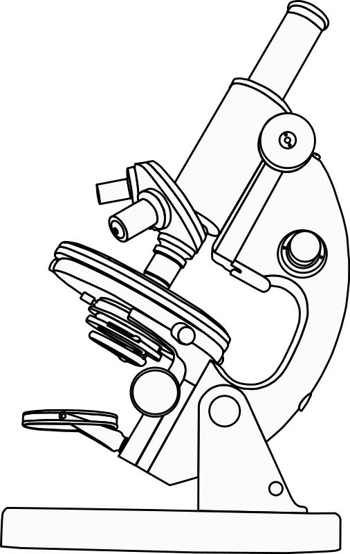

# Science ! Python! Unicorns! (and some important personnal news) 

As a break from my "tradition" of not going into more "personal" stuff on this site , I thought I would share a bit of  personal news , since well, it is **very good** news, and will have an impact on the various projects  I post about...

It might have come to your attention, that my posts have been getting sparser in the last few months:  and these are the main reasons for that:

- First and foremost , it is because of the heavy work I have been putting into my two main projects **HydroDuino** and **Dobozweb** ( see related post in a few days for a lot more details) and also because  of a major piece of news :
- I am now officially working as a **bio-informatician** at the French research institute [INRA](http://www.international.inra.fr/) in Versailles, (near Paris) , in the genomics and informatics unit  ([URGI](http://urgi.versailles.inra.fr/)) :  and guess what,? I will be working **a lot** in **Python** ! So,  major geeking  out here , as you can guess!

Working in research (specifically Biology and Informatics)  has been a dream of mine for... well forever , so I am still a quite bit "stunned" , it is the beginning of a new life in more ways that one!

So does this mean all my other projects will be abandoned?

- Fear not!  They are still under way !
- Even if i will have less time to work on them, i have done some major refactoring this summer that should help implement new features and improve existing ones more easily (this should become more clear in the next article about Doboz-web and Hydroduino).
- I also did a presentation about Doboz-web last weekend at **[PyconFr](http://www.pycon.fr/conference/edition2011)** (french Python conference) , which was an absolutely fantastic conference, with lots of great, passionate people, and interesting subjects , so  i will do a more detailed write-up about  that aswell soon!

As for the Unicorns in the title,  well,  they were likely [dreaming of electric sheep](http://en.wikipedia.org/wiki/Themes_in_Blade_Runner)...

Cheers!
