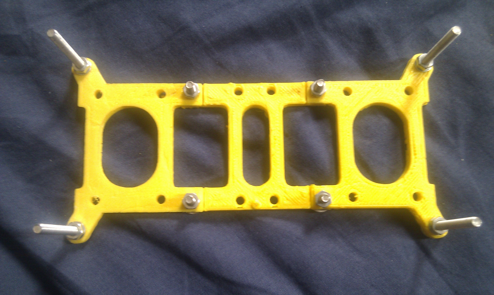

# The endless walz of reprap "self" upgrades 

I have been keeping quite quiet since the last update on the first successful movement of my second generation Reprap machine, and that is because i have been steadily improving and upgrading various parts of it, well, of "her" , since she is now dubbed "Aclara" (in dedication to my girlfriend's support and patience  since this is a more than just a bit time consuming passion..)

Here is an overview of the different problems i had , and the new /re designs i came up with.

These will all be relased on [Thingiverse](http://www.thingiverse.com/) (the fantastic open library of object designs , for those who haven't heard of it yet) once i cleaned them up :

(I will update the article then , with links to the objects)

\*\*first update : added link to the motherboard clamp object and the printable "squashed frog" \*\*

## Printed "squashed frog":

No worries, no animals were injured in the process!

The squashed frog is the part that is underneath the Y axis platform, and to which the belt as well as the bushings/bearings rolling on the rails are attached.

The initial version was cut manually from plexiglass, but due to my lack of good quality tools/workspace, while it worked , it certainly would not have won prizes for quality !

So i decided to design a printable version, that had to :

- be mechanically resistant enough
- be relatively fast to print
- be made of more than one part since it needed to be as big if not bigger than the maximum print size
- have mounting point for the bushings as well as the belt clamps

So here is the design i came up with:

- it is made of 3 parts , two of which are identical
- it requires 4 nuts and bolts to be assembled
- the inner holes with roundings enable the parts to be strong yet not use too much plastic
- it is relatively fast to build and easy to assemble
- it works well !

I have yet to test it with a heated build platform but i am not too worried, because if the printed bushings of people using a hbp don't melt, then there is no reason for this to melt :)

Available on thingiverse: [http://www.thingiverse.com/thing:9433](http://www.thingiverse.com/thing:9433)

## Stronger , simpler Y axis motor mount, with additional bearing holder

The motor mount iself  is actually a derivative of a design that can be found [here](http://www.thingiverse.com/thing:5514) on thingiverse.

I redesigned it from scratch to be parametric and modular, and to actually fit my machine :)

I also added a bearing holder on the other side, for easier, straighter belt mechanism.

(this also means that my machine only uses one type of smaller bearings (for M4 bolts) )

## X axis motor mount and idler redesign

Although the general shape stays the same , i redid the design from scratch in openscad as well.

My main beefs with the previous version of these elements were:

- glued on bushings not practical to mount
- lack of stability (way too wobly, but that might have been my bushings)
- motor mount was way too weak, and deformed very fast with the stepper motor's heat
- smooth rod holder screws not practical

So these were changed with to the following:

- a simple "M6" hole for the smooth rod rail
- a shorter height
- "rounded" and thickened motor mount with additional support underneath
- side holes for smooth rod mounting screws (instead of beeing at the bottom , like in the previous design

## Reprap gen7 motherboard clamps:

Once again, the previous motherboard "holder" was just a big piece of plexiglass, held in place by zip ties, nice, but not "minimal", nor quick.

So i came up with these clamps, to be fited on the structure's threaded rods, that already hold well by simple tension, but which are even more stable thanks to the inwards pressure once you screw the motherboard onto them.

Available on thingiverse :[http://www.thingiverse.com/thing:9432](http://www.thingiverse.com/thing:9432)

 

## Various higher quality reprints:

In addition to all the elements that needed designing / redesigning , i also re printed a certain number of elements that were not of good enough quality (and it helps that the new machine prints these at 15X the speed of my old "Doboz" machine !

All of the critical , or weaker elements were reprinted aswell : gears, gears gears, extruder elements etc

So this is what the machine looks like now :

As a famous band once said " and it was allll yeloww" (well not ALL yellow in this case, but at this rate, all the old (black) pieces will soon be gone...)
