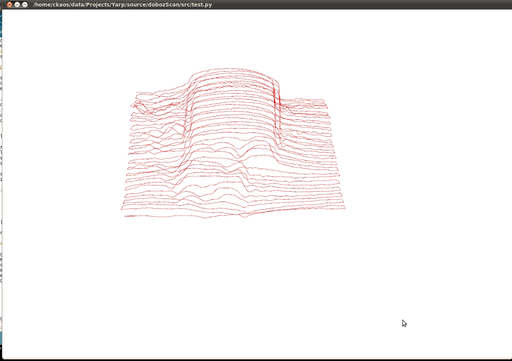

# Turning a Rep(st)rap into a working ( but  limited ) 3d scanner for less than 5 euros. 

Having a 3d scanning capability integrated into the Doboz repstrap system was planned from the beginning, but finally got put into place.

Although using the cartesian bot part of the Repstrap was part of the plan from the start , I decided to use an easier ( and cheaper) approach first, before switching to a laser line/ webcam based system.

Here is the rundown on what you need:

- a pair of IR photodiode/ IR Led
- a resitor
- a few cables
- a perfboard

Total cost : **5 euro tops**

And that's it folks ! The good thing about having such a simple system , is that it is also really lightweight, and can be added by the side of the extruder mechanism and not cause any problems.

On the software side of things, it's a bit more complex, but nothing overly complicated:

- after each movement, the signal from the photodiode is sent back via serial
- that signal's strengh is then converted into **height** information
- the X and Y component of each vertex building up the 3d point cloud are simply the respective x and y axis position at the time of the scan
- after creating an additional vertex in the point cloud, you can just link it to the previous vertices for display (i'm currently using simple GL\_LINES in opengl

The current version is very experimental , and hardly accurate ( i only tried with a one mm resolution , which is rather bad), but with plenty of room for improvements.

Also:

- this **WILL** be released in **open source** format, both host and firmware side, schematics etc
- the results shown here are somewhat old , and the screenshot and video quality are not that great, sorry
- if you have ideas for improvements, contact me!

I tested it with a simple lighter : 

A video of the onscreen result :  And the scanning process itself (keep in mind, this is relatively old, before even having a gcode interpreter, hence the "stacato")

